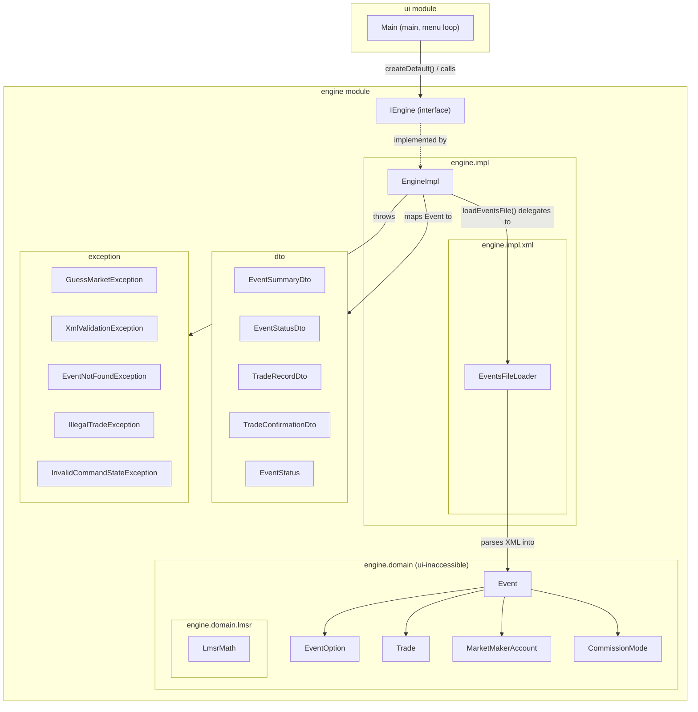

# Architecture

Macro-level documentation per CLAUDE.md Section 7. This file is **append-only** — new stages
add entries here, existing entries are not rewritten away. Grouped by module.

---

## `engine` module

### `engine` package

#### `IEngine` (`engine/src/engine/IEngine.java`)
- **What it is:** An "interface" — a list of method names and signatures with no
  implementation. Any class that wants to act as the engine must provide a body for every
  method listed here. It also carries one `static` method, `createDefault()`, which is a
  small factory that builds the real engine instance.
- **Why it exists:** It's the one boundary `ui` is allowed to depend on. As long as this
  shape doesn't change, `ui` can be swapped out (JavaFX in Ex2, an HTTP client in Ex3)
  without touching the engine, and the engine's internals can change freely without
  breaking `ui`. `createDefault()` exists specifically so `ui` can obtain a working engine
  instance without ever importing `engine.impl.EngineImpl` by name — the constructor call
  lives inside the `engine` module, where referencing its own internal class is legitimate.
- **What it connects to:** Implemented by `engine.impl.EngineImpl`. `ui.Main` calls
  `IEngine.createDefault()` → gets an `IEngine` reference → calls `listEvents()` → gets
  back `List<EventSummaryDto>` → prints one row per event, 1-based. Its method signatures
  reference DTO types from `dto` and exception types from `exception`, and nothing else.

### `engine.impl` package

#### `EngineImpl` (`engine/src/engine/impl/EngineImpl.java`)
- **What it is:** The one concrete class that implements `IEngine`. `loadEventsFile()` and
  `listEvents()` are now fully real; the other 3 methods still just throw
  `UnsupportedOperationException` as placeholders.
- **Why it exists:** Gives the project something that can actually be instantiated and
  passed to `ui` as an `IEngine`, so the wiring between modules is provable even before all
  business logic exists. Kept in its own `impl` sub-package (separate from `engine.IEngine`
  itself) specifically so `ui` has no legitimate import path to this class — only to the
  interface.
- **What it connects to:** Implements `engine.IEngine`. `loadEventsFile()` delegates entirely
  to `engine.impl.xml.EventsFileLoader.load()`, which does all path validation, XML parsing,
  and business-rule validation and returns a fully-built `List<Event>` (or throws before
  returning anything); `EngineImpl` only then clears and repopulates its internal
  `Map<Integer, Event>` — so a failed load never touches the previously-loaded valid state.
  `listEvents()` maps each `Event` to an `EventSummaryDto` via the private `toSummaryDto()`
  helper and returns the list, or throws `InvalidCommandStateException` if the map is empty
  (i.e. no file has been loaded yet — reachable now that no hardcoded sample data seeds the
  map). Constructed by `ui.Main` exclusively through `IEngine.createDefault()`, never
  directly.

### `engine.domain` package

Holds the engine's real internal state — plain Java classes, private fields, constructor +
getters only, no behavior yet. Nested under `engine` (like `engine.impl`) rather than
top-level, specifically because `ui` must never see these — only `dto` and `exception` are
the intentionally top-level, `ui`-facing packages.

#### `CommissionMode` (`engine/src/engine/domain/CommissionMode.java`)
- **What it is:** An enum with two values, `ON_PURCHASE` and `ON_CLOSE`.
- **Why it exists:** Represents which of the two commission-collection modes (Section 4)
  an event uses, instead of a loose `String` or `boolean`.
- **What it connects to:** Stored as a field on `Event`. Will be read by the (not-yet-
  written) trading and closing logic to decide when to charge commission.

#### `EventOption` (`engine/src/engine/domain/EventOption.java`)
- **What it is:** A small class holding just a name — one of an event's two outcomes
  (what the XML calls a `GM-option`).
- **Why it exists:** Every event needs exactly two of these; giving the outcome its own
  type (rather than a bare `String`) leaves room to attach LMSR-related state (e.g. shares
  outstanding) once that math is implemented.
- **What it connects to:** Held as `optionOne`/`optionTwo` fields on `Event` (two named
  fields, not a list — so "exactly two options" is structural, not just validated at
  runtime). Referenced by `Trade.option` to record which option a purchase was for.

#### `Trade` (`engine/src/engine/domain/Trade.java`)
- **What it is:** A record of one executed purchase — which option, how much, at what
  price, how much commission, and when.
- **Why it exists:** The engine's own internal memory of trade history; its field shape
  mirrors `dto.TradeRecordDto` on purpose, since mapping one to the other is exactly what
  will happen once `getEventStatus()` is wired up.
- **What it connects to:** Held inside an `Event`'s `tradeHistory` list. Will be created
  internally by the (not-yet-written) `participateInEvent` trading logic, and eventually
  mapped to `dto.TradeRecordDto` for `ui` to see (never handed to `ui` directly, per the
  deep-DTO rule in CLAUDE.md Section 2).

#### `MarketMakerAccount` (`engine/src/engine/domain/MarketMakerAccount.java`)
- **What it is:** A small class holding two numbers: the account's current balance and its
  lifetime total commission collected.
- **Why it exists:** Each event has its own MM account (Section 4) that subsidy is paid
  into, commissions are collected into, and payouts are made from; keeping the running
  balance and the lifetime commission total as separate fields matches the "event trading
  status" view needing to show both independently.
- **What it connects to:** Held as the `marketMakerAccount` field on `Event`. Will be
  mutated internally by the (not-yet-written) trading/closing logic — no public mutators
  exist yet since nothing calls them today.

#### `Event` (`engine/src/engine/domain/Event.java`)
- **What it is:** The engine's real internal representation of one Guess Market event —
  everything `Event Trading Status` and the other commands need to know: id, name,
  description, its two options, commission config, its LMSR liquidity parameter (the spec's
  `b`), its MM account, current status, and trade history.
- **Why it exists:** This is the actual domain object CLAUDE.md Section 2 says must never
  cross the `engine`→`ui` boundary directly; every value `ui` sees is mapped from this into
  a `dto` type first (e.g. `EngineImpl.toSummaryDto` builds an `EventSummaryDto` from one).
  Reuses `dto.EventStatus` for its `status` field rather than a separate domain-only enum,
  since that enum has no behavior and isn't the kind of mutable state the deep-DTO rule
  targets. `description` and `liquidityParameter` were added in the Load-XML stage because
  parsing the file is the only time this data is ever available — later commands (price
  display, trading) read it back off the already-built `Event`, never by re-parsing XML.
- **What it connects to:** Built by `engine.impl.xml.EventsFileLoader.buildEvent()` from a
  parsed `GM-event` XML element, one fresh instance per loaded event (no reuse across
  loads). Read by `EngineImpl.toSummaryDto()` to build the DTO `ui` actually sees. Its
  `getTradeHistory()` returns an unmodifiable view of its internal `List<Trade>` so nothing
  outside `Event` can mutate engine state through the reference.

### `engine.domain.lmsr` package

#### `LmsrMath` (`engine/src/engine/domain/lmsr/LmsrMath.java`)
- **What it is:** A class with no instances (only `static` methods) implementing the two LMSR
  formulas from `docs-reference/lmsr-appendix.md`: the cost function `C(q1, q2)` and the price
  of one option. A third method, `purchaseCost`, gives the cost of buying more shares as
  `cost(after) - cost(before)`.
- **Why it exists:** Isolates the actual pricing math as pure functions of numbers — no
  dependency on `Event` or anything else — so it can be tested in isolation (see
  `LmsrMathTest`) and reused later by trading logic without that logic needing to know *how*
  the math works, only that it can call `LmsrMath.price(...)`/`LmsrMath.purchaseCost(...)`.
  Deliberately has no relationship to `Event` via inheritance or otherwise: trading logic will
  *use* these methods (composition), not extend or implement anything LMSR-shaped, keeping the
  door open for Ex2's Order Book to be an entirely separate, unrelated mechanism.
- **What it connects to:** Not called from anywhere yet — `EngineImpl`'s trading commands
  (`participateInEvent`, `closeEvent`) are still unimplemented placeholders. Verified against
  the appendix's worked example by `engine/test/engine/domain/lmsr/LmsrMathTest.java`, run via
  the JUnit Platform Console Standalone jar in `lib/` (test-only dependency — never bundled
  into `engine.jar`). `test.bat` at the project root compiles and runs it.

### `engine.impl.xml` package

#### `EventsFileLoader` (`engine/src/engine/impl/xml/EventsFileLoader.java`)
- **What it is:** A class with no instances (only `static` methods) that turns a file path
  into a validated list of `engine.domain.Event` objects. It's the entire "read an events
  XML file" pipeline in one place: check the path, parse the XML, validate every business
  rule, and build domain objects — or throw `XmlValidationException` before building
  anything if any step fails.
- **Why it exists:** Keeps `EngineImpl.loadEventsFile()` a thin one-line delegator instead of
  a god-method, and keeps every part of "how do we read this XML file" (including the
  `commission`/`comision` tag-name mismatch between the spec text and the lecturer's real
  files — see `findCommissionElement()`) isolated in one small package nobody outside
  `engine.impl` can import. Uses plain JDK DOM parsing (`javax.xml.parsers`), not JAXB — no
  external dependency needed at this file scale, avoiding real JAR-packaging risk on a
  plain multi-module IntelliJ project with no Maven/Gradle.
- **What it connects to:** Called by `EngineImpl.loadEventsFile()`. Its `load()` entry point
  returns `List<Event>` on success or throws `exception.XmlValidationException` with a
  specific message per violation (bad path/extension, missing file, duplicate id,
  commission out of `[0,90]`, wrong `GM-option` count). On success it also computes each
  event's initial LMSR subsidy (`b · ln(2)`, per `docs-reference/lmsr-appendix.md`'s worked
  example) and constructs each event's `MarketMakerAccount` with that as its starting
  balance.

### `dto` package

#### `EventStatus` (`engine/src/dto/EventStatus.java`)
- **What it is:** An "enum" — a type with a fixed, named set of possible values. Here there
  are exactly two: `ACTIVE` and `CLOSED`.
- **Why it exists:** Gives an event's lifecycle state a single, unambiguous representation
  instead of a loose `String` or `boolean`. Deliberately limited to two values for
  Exercise 1 (there's no "not started" phase yet), but isolated enough that Ex2 can add a
  third value as a localized change.
- **What it connects to:** Used as a field inside `EventSummaryDto` and `EventStatusDto`,
  and directly reused as the `status` field type on the domain `engine.domain.Event` class
  itself (no separate domain-only enum, since this one has no behavior). Set when an
  `Event` is constructed (currently by `EngineImpl`'s hardcoded sample data; by XML loading
  once that exists); read by `ui.Main` to decide what to print.

#### `EventSummaryDto` (`engine/src/dto/EventSummaryDto.java`)
- **What it is:** A "record" — a small immutable class that just holds a fixed set of
  fields (here: an event's id, name, and status) with no other behavior.
- **Why it exists:** Lets `listEvents()` hand `ui` exactly the data needed to print one row
  of the event list, without ever exposing the engine's real internal `Event` object
  (which `ui` must never see, per Section 2).
- **What it connects to:** Returned inside a `List<EventSummaryDto>` by
  `IEngine.listEvents()` (built there by `EngineImpl.toSummaryDto()`). Consumed by
  `ui.Main.printEvents()`, which prints one row per event, 1-based.

#### `TradeRecordDto` (`engine/src/dto/TradeRecordDto.java`)
- **What it is:** A record describing a single past trade — which option, how much, at
  what price, how much commission, and when.
- **Why it exists:** Lets the event-status view show trade history as structured data
  rather than pre-formatted strings, without exposing whatever internal trade object the
  engine ends up using.
- **What it connects to:** Held in the `tradeHistory` list field of `EventStatusDto`. Will
  be produced internally by the engine every time a trade happens (not yet written), and
  printed newest-first by `ui`'s "event trading status" command.

#### `EventStatusDto` (`engine/src/dto/EventStatusDto.java`)
- **What it is:** A record bundling everything the "event trading status" screen needs in
  one shape: both option prices, the event's MM account balance, total commission
  collected so far, and the trade history list.
- **Why it exists:** One DTO shape covers both `getEventStatus()` (viewing a live event)
  and `closeEvent()` (viewing the final settled state), so `ui` only needs one rendering
  routine for both.
- **What it connects to:** Returned by `IEngine.getEventStatus(int)` and
  `IEngine.closeEvent(int, int)`. Its `tradeHistory` field is a `List<TradeRecordDto>`.
  Will be consumed by `ui`'s trading-status and close-event commands (not yet written).

#### `TradeConfirmationDto` (`engine/src/dto/TradeConfirmationDto.java`)
- **What it is:** A record summarizing the outcome of one successful trade: which option
  was bought, how much, at what price, how much commission was charged, and the total
  cost.
- **Why it exists:** Gives `ui` a clean, structured receipt to print right after a
  purchase, instead of reaching into engine internals to describe what just happened.
- **What it connects to:** Returned by `IEngine.participateInEvent(int, int, double)`.
  Will be consumed by `ui`'s "participate in an event" command (not yet written) to print
  a confirmation message.

### `exception` package

#### `GuessMarketException` (`engine/src/exception/GuessMarketException.java`)
- **What it is:** An `abstract` class — one that can never be instantiated directly, only
  extended. It extends Java's built-in `RuntimeException`.
- **Why it exists:** Gives every engine-thrown failure a common ancestor type, in case
  `ui` (or a future caller) ever wants a single defensive fallback `catch`, while each
  concrete subtype below still carries its own specific, distinguishable meaning and
  message.
- **What it connects to:** Parent class of `XmlValidationException`,
  `EventNotFoundException`, `IllegalTradeException`, and `InvalidCommandStateException`.
  Because it extends `RuntimeException`, none of its subtypes need to be declared with
  `throws` to compile — `IEngine` declares them anyway, purely for readability.

#### `XmlValidationException` (`engine/src/exception/XmlValidationException.java`)
- **What it is:** A specific failure type for problems with a loaded events XML file:
  missing file, wrong extension, duplicate event id, out-of-range commission, or an event
  without exactly two options.
- **Why it exists:** Gives `ui` one distinct, catchable category for "the file you gave me
  is bad," separate from trade or lookup failures, so it can render a specific message per
  CLAUDE.md's specificity requirement.
- **What it connects to:** Declared on `IEngine.loadEventsFile(String)`. Will be thrown
  internally by the engine's (not-yet-written) XML load/parse/validate pipeline, and
  caught by `ui`'s "load XML events file" command (not yet written).

#### `EventNotFoundException` (`engine/src/exception/EventNotFoundException.java`)
- **What it is:** Thrown when a caller refers to an event id that doesn't exist in the
  currently loaded data.
- **Why it exists:** A dedicated category for "no such event," reused by three different
  `IEngine` methods that all need to look an event up by id — kept separate from
  `InvalidCommandStateException` because "missing data" and "wrong state" are different
  kinds of problems for `ui` to explain to the user.
- **What it connects to:** Declared on `IEngine.getEventStatus`,
  `IEngine.participateInEvent`, and `IEngine.closeEvent`. Will be thrown internally by the
  engine's (not-yet-written) event-lookup logic and caught by `ui`.

#### `IllegalTradeException` (`engine/src/exception/IllegalTradeException.java`)
- **What it is:** Thrown when a requested trade breaks a trading rule: an invalid option
  number, a non-positive amount, or trading on an event that's already closed.
- **Why it exists:** Separates "this trade request itself is invalid" from "the event
  doesn't exist" or "this command doesn't belong right now," so `ui` can tell the user
  exactly what was wrong with their input.
- **What it connects to:** Declared on `IEngine.participateInEvent` and
  `IEngine.closeEvent`. Will be thrown internally by the engine's (not-yet-written)
  trading and closing logic, and caught by `ui`.

#### `InvalidCommandStateException` (`engine/src/exception/InvalidCommandStateException.java`)
- **What it is:** Thrown when a command is invoked in a state where it doesn't make sense,
  independent of any specific event id or trade input — e.g. closing an event that's
  already closed, or running a command before any file has been loaded.
- **Why it exists:** Catches the remaining "wrong moment for this" failures that aren't
  about a missing event or a bad trade value.
- **What it connects to:** Declared on `IEngine.listEvents` and `IEngine.closeEvent`. Will
  be thrown internally by the engine and caught by `ui`.

---

## `ui` module

### `ui` package

#### `Main` (`ui/src/ui/Main.java`)
- **What it is:** The application's entry point — the `main` method the JVM looks for and
  calls first when the JAR is run. Right now it does two things: load one events file (path
  from `args[0]`, or a hardcoded default), then list and print events — there's no menu loop
  yet.
- **Why it exists:** Every runnable Java program needs a `main` method. It currently exists
  as a minimal, deliberately narrow proof that the `engine`→`dto`→`ui` wiring genuinely
  works end-to-end, before the real 6-command menu loop (a separate later step) is built on
  top of it.
- **What it connects to:** Calls `IEngine.createDefault()` → gets an `IEngine` reference
  (never `EngineImpl` by name) → calls `loadEventsFile(filePath)`, catching
  `XmlValidationException` and printing its message instead of crashing → then calls
  `listEvents()` → gets back `List<EventSummaryDto>` → its private `printEvents()` helper
  prints one line per event, numbered from 1. Also catches `InvalidCommandStateException`
  (declared by `listEvents()`), which is now reachable in practice if the load step failed
  and no file was ever successfully loaded.
