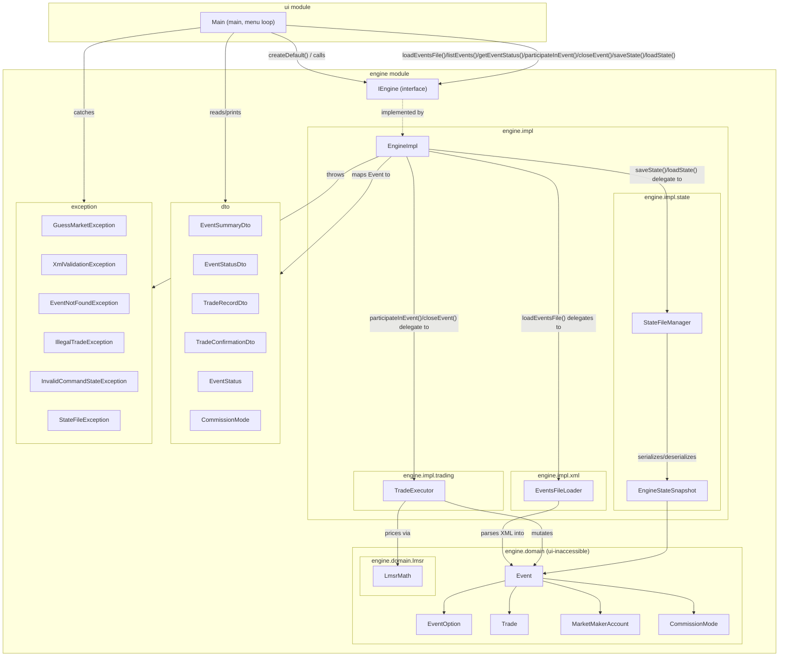

# Architecture

Macro-level documentation per CLAUDE.md Section 7. This file is **append-only** — new stages
add entries here, existing entries are not rewritten away. Grouped by module.

---

## `engine` module

### `engine` package

#### `IEngine` (`engine/src/engine/IEngine.java`)
- **What it is:** An "interface" — a list of method names and signatures with no
  implementation. Any class that wants to act as the engine must provide a body for every
  method listed here. It also carries one `static` method, `createDefault()`, which is a
  small factory that builds the real engine instance.
- **Why it exists:** It's the one boundary `ui` is allowed to depend on. As long as this
  shape doesn't change, `ui` can be swapped out (JavaFX in Ex2, an HTTP client in Ex3)
  without touching the engine, and the engine's internals can change freely without
  breaking `ui`. `createDefault()` exists specifically so `ui` can obtain a working engine
  instance without ever importing `engine.impl.EngineImpl` by name — the constructor call
  lives inside the `engine` module, where referencing its own internal class is legitimate.
- **What it connects to:** Implemented by `engine.impl.EngineImpl`. `ui.Main` calls
  `IEngine.createDefault()` → gets an `IEngine` reference → calls `listEvents()` → gets
  back `List<EventSummaryDto>` → prints one row per event, 1-based. Its method signatures
  reference DTO types from `dto` and exception types from `exception`, and nothing else.
  `participateInEvent`'s third parameter was fixed from the skeleton stage's `double amount`
  to `int shareQuantity` while implementing it — the spec's third argument is a share count,
  not a dollar figure, and nothing depended on the old signature yet.
  **Save/Load-State bonus stage:** two methods added, `saveState(String filePath)` and
  `loadState(String filePath)`, for the bonus feature that persists the *entire* live system
  (every event, all trade history, account balances) to a file of the engine's own choosing —
  explicitly distinct from `loadEventsFile`'s XML format. Both throw `StateFileException`;
  `saveState` also throws `InvalidCommandStateException` (nothing to save if nothing is loaded).

### `engine.impl` package

#### `EngineImpl` (`engine/src/engine/impl/EngineImpl.java`)
- **What it is:** The one concrete class that implements `IEngine`. All 5 implemented-so-far
  methods (`loadEventsFile()`, `listEvents()`, `getEventStatus()`, `participateInEvent()`,
  `closeEvent()`) are now fully real — every `IEngine` method Exercise 1 requires.
- **Why it exists:** Gives the project something that can actually be instantiated and
  passed to `ui` as an `IEngine`, so the wiring between modules is provable even before all
  business logic exists. Kept in its own `impl` sub-package (separate from `engine.IEngine`
  itself) specifically so `ui` has no legitimate import path to this class — only to the
  interface.
- **What it connects to:** Implements `engine.IEngine`. `loadEventsFile()` delegates entirely
  to `engine.impl.xml.EventsFileLoader.load()`, which does all path validation, XML parsing,
  and business-rule validation and returns a fully-built `List<Event>` (or throws before
  returning anything); `EngineImpl` only then clears and repopulates its internal
  `Map<Integer, Event>` — so a failed load never touches the previously-loaded valid state.
  `listEvents()` maps each `Event` to an `EventSummaryDto` via the private `toSummaryDto()`
  helper (which now also calls `toDtoCommissionMode()` to translate
  `engine.domain.CommissionMode` into the dto-level `dto.CommissionMode` ui is allowed to see)
  and returns the list, or throws `InvalidCommandStateException` if the map is empty.
  Two private lookup helpers, `findEvent()`/`findActiveEvent()`, back every method that needs
  an event by id: both throw `InvalidCommandStateException` (shared `NO_FILE_LOADED_MESSAGE`
  constant, also now used by `listEvents()`) if nothing has ever been loaded, then
  `EventNotFoundException` if the id is unknown; `findActiveEvent()` additionally throws
  `IllegalTradeException` if the event isn't `ACTIVE` (checked as `!= ACTIVE`, not
  `== CLOSED`, so a future 3rd `EventStatus` value in Ex2 is still rejected correctly without
  touching this code). `getEventStatus()` calls `findEvent()` (works for closed events too)
  then the private `toStatusDto()` mapper, which computes both option prices via
  `LmsrMath.price(...)` and builds trade history newest-first (by reversing `Event`'s
  chronological storage order, not sorting by timestamp). `participateInEvent()` calls
  `findActiveEvent()`, delegates the actual purchase to
  `engine.impl.trading.TradeExecutor.participate()`, then combines the resulting `Trade` and
  the freshly-mutated `Event` into a `TradeConfirmationDto` via `toTradeConfirmationDto()`
  (which itself calls `toStatusDto()` — one shared mapper, three call sites, no duplicated
  DTO-building logic). `closeEvent()` follows the same pattern: `findActiveEvent()`, delegate
  to `TradeExecutor.close()`, then `toStatusDto()` on the now-`CLOSED` event for the return
  value — `toStatusDto()` needed no changes to support this, since it already reads
  `Event.getWinningOption()` (`null` until `close()` sets it) for the DTO's
  `winningOptionName` field. Constructed by `ui.Main` exclusively through
  `IEngine.createDefault()`, never directly.

### `engine.domain` package

Holds the engine's real internal state — plain Java classes, private fields, constructor +
getters only, no behavior yet. Nested under `engine` (like `engine.impl`) rather than
top-level, specifically because `ui` must never see these — only `dto` and `exception` are
the intentionally top-level, `ui`-facing packages.

#### `CommissionMode` (`engine/src/engine/domain/CommissionMode.java`)
- **What it is:** An enum with two values, `ON_PURCHASE` and `ON_CLOSE`.
- **Why it exists:** Represents which of the two commission-collection modes (Section 4)
  an event uses, instead of a loose `String` or `boolean`.
- **What it connects to:** Stored as a field on `Event`. Read by
  `engine.impl.trading.TradeExecutor`'s `participate()`/`close()` to decide when commission is
  charged.

#### `EventOption` (`engine/src/engine/domain/EventOption.java`)
- **What it is:** A small class holding a name and a running `sharesOutstanding` count — one
  of an event's two outcomes (what the XML calls a `GM-option`).
- **Why it exists:** Every event needs exactly two of these; giving the outcome its own
  type (rather than a bare `String`) is what let `sharesOutstanding` + `addShares()` get
  attached directly to it once LMSR trading needed somewhere to track "how many shares of
  *this* option have been bought" — the number `LmsrMath.price()`/`purchaseCost()` need as
  each option's `q`.
- **What it connects to:** Held as `optionOne`/`optionTwo` fields on `Event` (two named
  fields, not a list — so "exactly two options" is structural, not just validated at
  runtime). Referenced by `Trade.option` to record which option a purchase was for.
  `addShares()` is called by `engine.impl.trading.TradeExecutor.participate()`; nothing
  validates its input (must be positive) since that's `TradeExecutor`'s job, not this class's.
  **Save/Load-State bonus stage:** now `implements Serializable` (+ `serialVersionUID`), so
  `engine.impl.state.StateFileManager` can write/read it as part of an `Event`'s object graph.

#### `Trade` (`engine/src/engine/domain/Trade.java`)
- **What it is:** A record of one executed purchase — which option, how much, at what
  price, how much commission, and when.
- **Why it exists:** The engine's own internal memory of trade history; its field shape
  mirrors `dto.TradeRecordDto` on purpose, since mapping one to the other is exactly what
  `EngineImpl.toTradeRecordDto()` does.
- **What it connects to:** Held inside an `Event`'s `tradeHistory` list via `Event.addTrade()`.
  Created by `engine.impl.trading.TradeExecutor.participate()` — `pricePerShare` holds the
  share cost alone (no commission), `commissionPaid` and `totalPaid` are tracked as separate
  fields, so "price paid" in trade-history display can mean share-cost-alone without losing
  the other two numbers. Mapped to `dto.TradeRecordDto` by `EngineImpl.toTradeRecordDto()`
  (never handed to `ui` directly, per the deep-DTO rule in CLAUDE.md Section 2).
  **Save/Load-State bonus stage:** now `implements Serializable` (+ `serialVersionUID`); its
  `option` field aliases the same `EventOption` instance the owning `Event` holds, and Java's
  built-in serialization preserves that reference identity across a save/load round-trip
  (verified explicitly by `SaveLoadStateTest.roundTripsEveryFieldAndPreservesObjectIdentity()`).
  `timestamp`'s type, `java.time.LocalDateTime`, is already `Serializable` in the JDK.

#### `MarketMakerAccount` (`engine/src/engine/domain/MarketMakerAccount.java`)
- **What it is:** A small class holding two numbers: the account's current balance and its
  lifetime total commission collected.
- **Why it exists:** Each event has its own MM account (Section 4) that subsidy is paid
  into, commissions are collected into, and payouts are made from; keeping the running
  balance and the lifetime commission total as separate fields matches the "event trading
  status" view needing to show both independently.
  **Save/Load-State bonus stage:** now `implements Serializable` (+ `serialVersionUID`); a
  negative `balance` serializes/deserializes as an ordinary `double`, no special handling
  needed.
- **What it connects to:** Held as the `marketMakerAccount` field on `Event`. `credit()` and
  `addCommissionCollected()` are called by `engine.impl.trading.TradeExecutor.participate()`
  on every purchase; `debit()` is called by `TradeExecutor.close()` for the winning payout.
  No validation inside any mutator — all three are simple `+=`/`-=` adjustments; the caller is
  responsible for passing sensible values. `debit()` never clamps at 0 — CLAUDE.md Section 4
  explicitly allows (expects) the balance to go negative when the MM pays out more than it
  collected.

#### `Event` (`engine/src/engine/domain/Event.java`)
- **What it is:** The engine's real internal representation of one Guess Market event —
  everything `Event Trading Status` and the other commands need to know: id, name,
  description, its two options, commission config, its LMSR liquidity parameter (the spec's
  `b`), its MM account, current status, and trade history.
- **Why it exists:** This is the actual domain object CLAUDE.md Section 2 says must never
  cross the `engine`→`ui` boundary directly; every value `ui` sees is mapped from this into
  a `dto` type first (e.g. `EngineImpl.toSummaryDto` builds an `EventSummaryDto` from one).
  Reuses `dto.EventStatus` for its `status` field rather than a separate domain-only enum,
  since that enum has no behavior and isn't the kind of mutable state the deep-DTO rule
  targets. `description` and `liquidityParameter` were added in the Load-XML stage because
  parsing the file is the only time this data is ever available — later commands (price
  display, trading) read it back off the already-built `Event`, never by re-parsing XML.
- **What it connects to:** Built by `engine.impl.xml.EventsFileLoader.buildEvent()` from a
  parsed `GM-event` XML element, one fresh instance per loaded event (no reuse across
  loads). Read by `EngineImpl.toSummaryDto()`/`toStatusDto()` to build the DTOs `ui` actually
  sees. Its `getTradeHistory()` returns an unmodifiable view of its internal `List<Trade>` so
  nothing outside `Event` can mutate engine state through the reference — the only way to add
  a trade is the `addTrade(Trade)` method. Two more methods, `getOption(int)` and
  `getOtherOption(int)`, resolve 1→`optionOne`/2→`optionTwo` (and the reverse); both are
  intentionally "dumb" — no validation that the number is 1 or 2 — because
  `engine.impl.trading.TradeExecutor` is where every trading-rule validation is centralized,
  and callers here are required to have already checked. `status` is no longer `final`: the
  new `close(EventOption winningOption)` method is the *only* place it ever changes, setting
  it to `CLOSED` and recording `winningOption` (a new field, `null` until `close()` runs, read
  back by `getWinningOption()`) — called exclusively by
  `engine.impl.trading.TradeExecutor.close()`.
  **Save/Load-State bonus stage:** now `implements Serializable` (+ `serialVersionUID`), the
  key retrofit that makes the save/load-state bonus feature possible. `winningOption` aliases
  the same instance as `optionOne` or `optionTwo` (set by `close()`), and this reference
  identity survives a save/load round-trip intact because
  `engine.impl.state.StateFileManager` writes an entire event graph in one `writeObject` call.

### `engine.domain.lmsr` package

#### `LmsrMath` (`engine/src/engine/domain/lmsr/LmsrMath.java`)
- **What it is:** A class with no instances (only `static` methods) implementing the two LMSR
  formulas from `docs-reference/lmsr-appendix.md`: the cost function `C(q1, q2)` and the price
  of one option. A third method, `purchaseCost`, gives the cost of buying more shares as
  `cost(after) - cost(before)`.
- **Why it exists:** Isolates the actual pricing math as pure functions of numbers — no
  dependency on `Event` or anything else — so it can be tested in isolation (see
  `LmsrMathTest`) and reused later by trading logic without that logic needing to know *how*
  the math works, only that it can call `LmsrMath.price(...)`/`LmsrMath.purchaseCost(...)`.
  Deliberately has no relationship to `Event` via inheritance or otherwise: trading logic will
  *use* these methods (composition), not extend or implement anything LMSR-shaped, keeping the
  door open for Ex2's Order Book to be an entirely separate, unrelated mechanism.
- **What it connects to:** Called by `engine.impl.trading.TradeExecutor.participate()`
  (`purchaseCost()` for the trade's cost) and by `EngineImpl.toStatusDto()` (`price()` for
  both options' current prices). Verified against the appendix's worked example by
  `engine/test/engine/domain/lmsr/LmsrMathTest.java`, run via the JUnit Platform Console
  Standalone jar in `lib/` (test-only dependency — never bundled into `engine.jar`). `test.bat`
  at the project root compiles and runs it.

### `engine.impl.xml` package

#### `EventsFileLoader` (`engine/src/engine/impl/xml/EventsFileLoader.java`)
- **What it is:** A class with no instances (only `static` methods) that turns a file path
  into a validated list of `engine.domain.Event` objects. It's the entire "read an events
  XML file" pipeline in one place: check the path, parse the XML, validate every business
  rule, and build domain objects — or throw `XmlValidationException` before building
  anything if any step fails.
- **Why it exists:** Keeps `EngineImpl.loadEventsFile()` a thin one-line delegator instead of
  a god-method, and keeps every part of "how do we read this XML file" (including the
  `commission`/`comision` tag-name mismatch between the spec text and the lecturer's real
  files — see `findCommissionElement()`) isolated in one small package nobody outside
  `engine.impl` can import. Uses plain JDK DOM parsing (`javax.xml.parsers`), not JAXB — no
  external dependency needed at this file scale, avoiding real JAR-packaging risk on a
  plain multi-module IntelliJ project with no Maven/Gradle.
- **What it connects to:** Called by `EngineImpl.loadEventsFile()`. Its `load()` entry point
  returns `List<Event>` on success or throws `exception.XmlValidationException` with a
  specific message per violation (bad path/extension, missing file, **zero `GM-event`
  elements anywhere in the document**, duplicate id, commission out of `[0,90]`, wrong
  `GM-option` count). On success it also computes each event's initial LMSR subsidy
  (`b · ln(2)`, per `docs-reference/lmsr-appendix.md`'s worked example) and constructs each
  event's `MarketMakerAccount` with that as its starting balance.
  - **Bug found and fixed during the Day 7 integration pass:** `extractEvents()` originally
    used `document.getElementsByTagName("GM-event")` with no check that it found anything —
    `getElementsByTagName` searches the whole document tree unscoped by root element, so a
    well-formed XML file with the *wrong* structure entirely (e.g. the reference XSD schema
    itself, root `<xs:schema>`, no `GM-event` anywhere) silently produced an **empty**
    `List<Event>` instead of an error. `EngineImpl.loadEventsFile` then "succeeded" at loading
    zero events, and the very next `listEvents()` call reported "no file loaded" — a
    misleading, silently-broken success rather than a clear rejection. Fixed with one check
    (`eventNodes.getLength() == 0` → throw `XmlValidationException`) before the extraction
    loop. Covered by `test_files/error-7-no-events.xml` (well-formed `Guess-Market` root, empty
    `GM-events` wrapper) as the on-spec regression case, in addition to the schema file itself
    as the edge case that originally surfaced it.

### `engine.impl.trading` package

#### `TradeExecutor` (`engine/src/engine/impl/trading/TradeExecutor.java`)
- **What it is:** A class with no instances (only `static` methods) with two entry points
  against an already-resolved `Event`: `participate()` (buys shares — validates the request,
  runs the LMSR cost/commission math, mutates the event's state, records the trade) and
  `close()` (declares the winning option, pays out, settles commission, marks the event
  closed). Both share one private `validateOptionNumber()` helper.
- **Why it exists:** Same shape and reasoning as `engine.impl.xml.EventsFileLoader` — keeps
  `EngineImpl.participateInEvent()`/`closeEvent()` thin delegators instead of god-methods, and
  gives trading-rule validation (bad option number, non-positive share quantity, a share
  quantity large enough to overflow the LMSR math, and — via `EngineImpl.findActiveEvent()`
  before either method is even called — a closed event) exactly one home. Takes an `Event`
  object, not an id: it never touches `EngineImpl`'s `events` map, so event lookup/existence/
  active-state checking stays entirely `EngineImpl`'s job.
- **What it connects to:** Called by `EngineImpl.participateInEvent()`/`closeEvent()` after
  `findActiveEvent()` has already confirmed the event exists and is `ACTIVE`.
  `participate()` first checks that the *resulting* share count for the chosen option, divided
  by the event's liquidity parameter, stays at or under `MAX_SAFE_SHARES_OVER_LIQUIDITY` (700 —
  comfortably under `Math.exp`'s ~709.78 overflow point) — rejecting with `IllegalTradeException`
  before touching any state if not, since `Math.exp` overflows to `Infinity` silently rather than
  throwing, and that `Infinity` would otherwise propagate all the way to `ui` as a garbage
  `Infinity`/`NaN` display (found and fixed during a Day 7+ follow-up: 100,000 shares against
  b=100 used to "succeed" with exactly that garbage). Only then computes cost via
  `LmsrMath.purchaseCost()`, applies commission only when `CommissionMode.ON_PURCHASE` (0 under
  `ON_CLOSE`), then calls `EventOption.addShares()`, `MarketMakerAccount.credit()`,
  `MarketMakerAccount.addCommissionCollected()`, and `Event.addTrade()`. `close()` reads the
  winning `EventOption.getSharesOutstanding()` as the payout owed, computes commission only when
  `CommissionMode.ON_CLOSE` (already collected per-trade under `ON_PURCHASE`, so 0 here), calls
  `MarketMakerAccount.addCommissionCollected()` (when non-zero) and
  `MarketMakerAccount.debit(payoutOwed - commissionAmount)`, then `Event.close(winningOption)` —
  both mutate the same `Event` object `EngineImpl` already holds a reference to. `participate()`
  returns the new `Trade`, which `EngineImpl.toTradeConfirmationDto()` combines with a
  freshly-built `EventStatusDto` (via `toStatusDto()`) into the `TradeConfirmationDto` `ui`
  receives; `close()` returns nothing — `EngineImpl.closeEvent()` calls `toStatusDto()` on the
  same, now-`CLOSED` `Event` afterward. Covered by
  `engine/test/engine/impl/trading/TradeExecutorTest.java` (commission math for both modes and
  both operations, the negative-balance-is-not-clamped case, the validation-rejection paths,
  and — for the overflow guard specifically — both the exact 100,000-share/b=100 case that
  surfaced the bug and a just-under-the-threshold case confirming legitimate large purchases
  still work), run by the same `test.bat` as `LmsrMathTest`.
  **Save/Load-State bonus stage:** `saveState()` guards on `events.isEmpty()` (same
  `InvalidCommandStateException` + `NO_FILE_LOADED_MESSAGE` pattern `findEvent()` already uses),
  then delegates the actual serialization to `engine.impl.state.StateFileManager.save()`.
  `loadState()` follows `loadEventsFile()`'s exact atomic-replace shape: `StateFileManager.load()`
  builds the entire new `Map<Integer, Event>` off to the side and throws before returning
  anything on any failure, so `EngineImpl` only clears and repopulates its live `events` field
  after the new state is fully known-good — a failed load never touches previously-loaded state,
  identical guarantee to Command 1.

### `engine.impl.state` package

#### `EngineStateSnapshot` (`engine/src/engine/impl/state/EngineStateSnapshot.java`)
- **What it is:** A small package-private `Serializable` class holding one field: the full list
  of currently-loaded events.
- **Why it exists:** The save/load-state bonus feature needs *something* to hand
  `ObjectOutputStream.writeObject()`. Wrapping the event list in its own class, rather than
  serializing `EngineImpl`'s live `Map<Integer, Event>` field directly, keeps the on-disk format
  decoupled from `EngineImpl`'s internal representation — e.g. a future format-version field
  could be added here without `EngineImpl` needing to change at all. Package-private since
  nothing outside `engine.impl.state` — not even `EngineImpl` — ever needs to see it directly.
- **What it connects to:** Built and written by `StateFileManager.save()`; read back and
  unwrapped by `StateFileManager.load()`. Holds `List<engine.domain.Event>` directly (not
  DTOs) — safe here specifically because this class never crosses the `engine`→`ui` boundary,
  unlike every DTO in the `dto` package.

#### `StateFileManager` (`engine/src/engine/impl/state/StateFileManager.java`)
- **What it is:** A class with no instances (only `static` methods) that saves the full engine
  state to a file and loads it back — the save/load-state bonus feature's entire file-handling
  pipeline in one place, mirroring `engine.impl.xml.EventsFileLoader`'s shape exactly (a pure
  builder; never touches `EngineImpl`'s live state itself).
- **Why it exists:** Keeps `EngineImpl.saveState()`/`loadState()` thin one-line delegators, same
  reasoning as `EventsFileLoader` for `loadEventsFile()`. Uses Java's built-in
  `ObjectOutputStream`/`ObjectInputStream` (the domain model is already a clean POJO graph with
  no static/global state, which is what makes this lightweight) rather than a hand-rolled
  format — and does so for a concrete reason, not just convenience: `Event.winningOption` and
  each `Trade.option` are the *same instance* as one of the event's own two `EventOption`
  fields, and serializing the whole graph in a single `writeObject` call preserves that
  reference identity automatically via Java's internal object-handle table. A hand-rolled
  format would have had to reconstruct that aliasing manually.
- **What it connects to:** `save(Map<Integer, Event>, String filePath)` is called by
  `EngineImpl.saveState()`; wraps the event map in one `EngineStateSnapshot` and writes it in a
  single `writeObject` call to `<filePath>.gmstate` (the `STATE_FILE_EXTENSION` constant — the
  user never types or sees this extension, per the bonus spec's "path without extension"
  requirement; the engine appends it). `load(String filePath)` is called by `EngineImpl.loadState()`;
  checks the file exists, reads back one object, and defensively confirms (via `instanceof`) it's
  actually an `EngineStateSnapshot` before rebuilding a fresh `Map<Integer, Event>` keyed by
  `event.getId()` — never touching any caller state itself. Both directions wrap every failure
  (missing file, blank path, any `IOException`/`ClassNotFoundException` from the underlying
  streams) into a specific `exception.StateFileException` message quoting the resolved path.
  Each stream (`FileOutputStream`/`FileInputStream`) is declared as its own try-with-resources
  variable rather than inlined into the `ObjectOutputStream`/`ObjectInputStream` constructor
  call — a real bug found while testing this stage: if the wrapping stream's constructor itself
  throws (e.g. `ObjectInputStream` rejecting a corrupt stream header), an inlined inner stream
  is never assigned anywhere and therefore never closed, which left the file locked on Windows
  (a JUnit `@TempDir` cleanup failure surfaced this during `test.bat`). Declaring both streams
  as separate resources guarantees the inner one still closes even when the outer constructor
  fails.

### `dto` package

#### `EventStatus` (`engine/src/dto/EventStatus.java`)
- **What it is:** An "enum" — a type with a fixed, named set of possible values. Here there
  are exactly two: `ACTIVE` and `CLOSED`.
- **Why it exists:** Gives an event's lifecycle state a single, unambiguous representation
  instead of a loose `String` or `boolean`. Deliberately limited to two values for
  Exercise 1 (there's no "not started" phase yet), but isolated enough that Ex2 can add a
  third value as a localized change.
- **What it connects to:** Used as a field inside `EventSummaryDto` and `EventStatusDto`,
  and directly reused as the `status` field type on the domain `engine.domain.Event` class
  itself (no separate domain-only enum, since this one has no behavior). Set when an
  `Event` is constructed (currently by `EngineImpl`'s hardcoded sample data; by XML loading
  once that exists); read by `ui.Main` to decide what to print.

#### `EventSummaryDto` (`engine/src/dto/EventSummaryDto.java`)
- **What it is:** A "record" — a small immutable class that just holds a fixed set of
  fields with no other behavior: id, name, description, commission rate/mode, both option
  names, and status — every field Command 2's spec text requires.
- **Why it exists:** Lets `listEvents()` hand `ui` exactly the data needed to print one full
  row of the event list, without ever exposing the engine's real internal `Event` object
  (which `ui` must never see, per Section 2). Originally only carried id/name/status; extended
  while building the real console UI once Command 2's actual field list
  (` docs-reference/exercise1-requirements.md:181–195`) was checked against it and found
  incomplete — the same category of gap-filling done to `EventStatusDto` earlier, just
  discovered here instead of during the trading-commands stage.
- **What it connects to:** Returned inside a `List<EventSummaryDto>` by
  `IEngine.listEvents()` (built there by `EngineImpl.toSummaryDto()`, which now also maps
  `engine.domain.CommissionMode` to the dto-level one via `toDtoCommissionMode()`). Consumed
  by `ui.Main.printEventSummaries()`, which prints one full block per event, 1-based — reused
  as the pre-selection list for the "pick an event" step in later commands, since the spec
  cross-references "per Command 2's details" for those too.

#### `CommissionMode` (`engine/src/dto/CommissionMode.java`)
- **What it is:** An enum with two values, `ON_PURCHASE` and `ON_CLOSE` — the dto-level
  counterpart to `engine.domain.CommissionMode`.
- **Why it exists:** `ui` must never see `engine.domain` types (Section 2), but
  `EventSummaryDto` needs to carry a commission mode for Command 2's display. Mirrors exactly
  how `dto.EventStatus` already solves the identical problem for event status: a small
  dto-level enum, kept separate from its domain counterpart rather than relocating the domain
  one (which would have meant touching `Event`, `TradeExecutor`, `EventsFileLoader`, and
  `TradeExecutorTest` — all already tested and working — for a purely cosmetic reason).
- **What it connects to:** Held as the `commissionMode` field on `EventSummaryDto`, set by
  `EngineImpl.toDtoCommissionMode()`. Read by `ui.Main.formatCommissionMode()` to print
  `"On Purchase"`/`"On Close"` instead of the raw constant name.

#### `TradeRecordDto` (`engine/src/dto/TradeRecordDto.java`)
- **What it is:** A record describing a single past trade — which option, how much, at
  what price, how much commission, and when.
- **Why it exists:** Lets the event-status view show trade history as structured data
  rather than pre-formatted strings, without exposing whatever internal trade object the
  engine ends up using.
- **What it connects to:** Held in the `tradeHistory` list field of `EventStatusDto`, produced
  by `EngineImpl.toTradeRecordDto()` from a domain `Trade` every time one exists, ordered
  newest-first by `EngineImpl.toStatusDto()`. Its `pricePerShare` is the share cost alone
  (`Trade.pricePerShare`) — commission and total-paid stay available as separate fields,
  matching the project's chosen meaning of "price paid" in trade-history display. Printed by
  `ui.Main.printEventStatus()` as one row per trade, or `"No trades yet."` when the list is
  empty.

#### `EventStatusDto` (`engine/src/dto/EventStatusDto.java`)
- **What it is:** A record bundling everything the "event trading status" screen needs in
  one shape: both options' names/prices/current shares outstanding, the event's MM account
  balance, total commission collected so far, the winning option's name (`null` until
  closed), and the trade history list.
- **Why it exists:** One DTO shape covers `getEventStatus()` (viewing a live or closed
  event), the status embedded inside a `TradeConfirmationDto`, and `closeEvent()`'s return
  value, so `ui` only needs one rendering routine for all three.
  `optionOneShares`/`optionTwoShares`/`winningOptionName` were added filling gaps against
  ` docs-reference/exercise1-requirements.md`'s actual Command 3 spec text, which the original
  shape didn't fully cover; `winningOptionName` is `null` until `closeEvent()` actually closes
  something.
- **What it connects to:** Returned by `IEngine.getEventStatus(int)`, embedded in
  `TradeConfirmationDto.eventStatus`, and by `IEngine.closeEvent(int, int)`. Built exclusively
  by `EngineImpl.toStatusDto()` — the one place this shape gets assembled, reused rather than
  re-derived at each call site. Its `tradeHistory` field is a `List<TradeRecordDto>`. Printed in
  full by `ui.Main.printEventStatus()` — Command 3's display, first wired this stage, reused
  as-is once Participate/Close hand it the same shape.

#### `TradeConfirmationDto` (`engine/src/dto/TradeConfirmationDto.java`)
- **What it is:** A record summarizing the outcome of one successful trade: which option was
  bought, how many shares, the share cost and commission paid as separate numbers, the total,
  and — nested inside it — the event's full `EventStatusDto` right after the trade.
- **Why it exists:** Gives `ui` a clean, structured receipt to print right after a purchase
  (per the spec: total paid, broken into shares-cost vs. commission) *and* the "Command 3"
  current-status view the spec also requires showing at that point — without duplicating
  `EventStatusDto`'s fields flatly. Nesting one DTO inside another is fine per CLAUDE.md;
  only nesting a raw domain object is forbidden.
- **What it connects to:** Returned by `IEngine.participateInEvent(int, int, int)`. Built by
  `EngineImpl.toTradeConfirmationDto()` from the `Trade` `TradeExecutor.participate()` returns
  plus a `toStatusDto()` call on the same, now-mutated `Event`. Consumed by
  `ui.Main.printTradeConfirmation()`, which prints the breakdown fields directly and delegates
  its nested `eventStatus` straight to `printEventStatus()`.

### `exception` package

#### `GuessMarketException` (`engine/src/exception/GuessMarketException.java`)
- **What it is:** An `abstract` class — one that can never be instantiated directly, only
  extended. It extends Java's built-in `RuntimeException`.
- **Why it exists:** Gives every engine-thrown failure a common ancestor type, in case
  `ui` (or a future caller) ever wants a single defensive fallback `catch`, while each
  concrete subtype below still carries its own specific, distinguishable meaning and
  message.
- **What it connects to:** Parent class of `XmlValidationException`,
  `EventNotFoundException`, `IllegalTradeException`, and `InvalidCommandStateException`.
  Because it extends `RuntimeException`, none of its subtypes need to be declared with
  `throws` to compile — `IEngine` declares them anyway, purely for readability.

#### `XmlValidationException` (`engine/src/exception/XmlValidationException.java`)
- **What it is:** A specific failure type for problems with a loaded events XML file:
  missing file, wrong extension, duplicate event id, out-of-range commission, or an event
  without exactly two options.
- **Why it exists:** Gives `ui` one distinct, catchable category for "the file you gave me
  is bad," separate from trade or lookup failures, so it can render a specific message per
  CLAUDE.md's specificity requirement.
- **What it connects to:** Declared on `IEngine.loadEventsFile(String)`. Thrown internally by
  `engine.impl.xml.EventsFileLoader`'s parse/validate pipeline; caught by `ui.Main`'s Command 1
  handler, which prints the message and never calls `engine` at all if its own cheap
  `.xml`-extension check fails first.

#### `EventNotFoundException` (`engine/src/exception/EventNotFoundException.java`)
- **What it is:** Thrown when a caller refers to an event id that doesn't exist in the
  currently loaded data.
- **Why it exists:** A dedicated category for "no such event," reused by three different
  `IEngine` methods that all need to look an event up by id — kept separate from
  `InvalidCommandStateException` because "missing data" and "wrong state" are different
  kinds of problems for `ui` to explain to the user.
- **What it connects to:** Declared on `IEngine.getEventStatus`,
  `IEngine.participateInEvent`, and `IEngine.closeEvent`. Thrown by `EngineImpl.findEvent()`
  when `events` is non-empty but doesn't contain the requested id; caught defensively by
  `ui.Main`'s Commands 3–5 (in practice unreachable there, since `ui` only ever passes an id it
  just displayed in a list, but the catch matches `IEngine`'s declared `throws` regardless).

#### `IllegalTradeException` (`engine/src/exception/IllegalTradeException.java`)
- **What it is:** Thrown when a requested trade breaks a trading rule: an invalid option
  number, a non-positive share quantity, a share quantity large enough to overflow the LMSR
  math, or trading on an event that's already closed.
- **Why it exists:** Separates "this trade request itself is invalid" from "the event
  doesn't exist" or "no file is loaded at all," so `ui` can tell the user exactly what was
  wrong with their input. This is also the resolved category for "closed event" specifically
  — see `InvalidCommandStateException`'s entry below for why that scenario landed here and
  not there, despite both classes' original doc comments mentioning it.
- **What it connects to:** Declared on `IEngine.participateInEvent` and `IEngine.closeEvent`.
  Thrown by `EngineImpl.findActiveEvent()` (event exists but isn't `ACTIVE`) and by
  `engine.impl.trading.TradeExecutor` (`validateOptionNumber()` for a bad option number;
  directly for a non-positive share quantity, and directly for a share quantity that would push
  the resulting `shares / liquidityParameter` past `MAX_SAFE_SHARES_OVER_LIQUIDITY`). Caught by
  `ui.Main`'s Commands 4/5, which print the message and return to the main menu rather than
  retrying the command.

#### `InvalidCommandStateException` (`engine/src/exception/InvalidCommandStateException.java`)
- **What it is:** Thrown when a command that requires loaded event data is invoked before any
  file has ever been loaded — independent of any specific event id.
- **Why it exists:** Its doc comment originally also listed "closing an event that's already
  closed" as an example, overlapping with `IllegalTradeException`'s own doc. Resolved in favor
  of `IllegalTradeException` for that case: this class's own stated scope is "independent of
  any specific event id," and "event #5 is closed" is inherently about one specific id, so it
  never actually fit here. This class is now reserved for the genuinely global case: nothing
  loaded at all.
- **What it connects to:** Declared on `IEngine.listEvents`, `IEngine.getEventStatus`,
  `IEngine.participateInEvent`, and `IEngine.closeEvent` — every method that needs loaded
  event data. Thrown by `EngineImpl.findEvent()` (and therefore also by `findActiveEvent()`,
  which calls it first) and directly by `listEvents()`, both using the same
  `NO_FILE_LOADED_MESSAGE` constant so the message is identical everywhere it's thrown.

#### `StateFileException` (`engine/src/exception/StateFileException.java`)
- **What it is:** A specific failure type covering the entire save/load-state bonus
  feature's file-handling category: a save that couldn't be written, or a load whose file is
  missing, unreadable/corrupt, or doesn't contain a valid saved state.
- **Why it exists:** None of the four pre-existing exception types fit — `XmlValidationException`'s
  own doc comment scopes it to "a loaded events XML file," and the other three are about
  event-lookup/trading, not file I/O. One new type, grouped by this failure category (not by
  individual call site) per CLAUDE.md's own exception-design guidance, plays the same role for
  save/load-state that `XmlValidationException` plays for XML loading.
- **What it connects to:** Declared on `IEngine.saveState` and `IEngine.loadState`. Thrown
  internally by `engine.impl.state.StateFileManager`'s save/load pipeline, wrapping every
  underlying `IOException`/`ClassNotFoundException` with a specific message quoting the file
  path; caught by `ui.Main`'s Commands 7/8 handlers, which print the message.

---

## `ui` module

### `ui` package

#### `Main` (`ui/src/ui/Main.java`)
- **What it is:** The application's entry point and the entire console UI — the only place in
  the project that imports `java.util.Scanner` or calls `System.out`. Runs the real 8-command
  menu loop (the original 6 plus the Save/Load-State bonus's two): show menu → read a command
  number → dispatch to that command's own small handler method → (loop) → repeat until Exit.
  Every command's output is framed by a plain-ASCII `SEPARATOR` line (a row of
  `-`, printed once in the main loop itself — before and after each command's dispatch — so no
  individual handler needs its own separator logic), and nested list content (event details
  under `printEventSummaries`, option-price lines and trade-history rows under
  `printEventStatus`) uses one shared `INDENT` constant rather than hand-typed spaces, so
  indentation can't silently drift between commands. Within `printEventSummaries` specifically,
  each individual event is further framed by a second, shorter `EVENT_SEPARATOR` (40 dashes,
  vs. `SEPARATOR`'s 60 — deliberately different lengths so the two nesting levels, one command's
  whole output vs. one event within a list inside it, stay visually distinguishable when
  scrolling back through a session), with a blank line between each of its 5 fields rather than
  packed tight. Since `printEventSummaries` is the single method behind both Command 2's list
  and the pre-selection list shown before Commands 3/4/5, this framing applies everywhere an
  event's full details are listed without needing to touch any of those four call sites.
- **Why it exists:** Every runnable Java program needs a `main` method, and per the module
  split (CLAUDE.md Section 2) this is the *only* place allowed to do I/O — `engine` never
  imports `Scanner`/`System.out` anywhere. The loop body itself is intentionally thin (one
  `switch`, one line per case) — all the actual read/print work lives in each command's own
  `handleX` method, per CLAUDE.md Section 5's no-god-methods rule.
- **What it connects to:** Calls `IEngine.createDefault()` once, then repeatedly calls
  whichever of `loadEventsFile`/`listEvents`/`getEventStatus`/`participateInEvent`/`closeEvent`
  the selected command needs. Every menu item is always printed and always selectable — state
  gating (e.g. "no file loaded yet") happens entirely through each handler catching the
  engine's own specific exception and printing its message, never through hiding a menu entry.
  An outer `catch (GuessMarketException e)` around the whole dispatch is a safety net beyond
  each handler's own specific catches, so the loop truly can't crash on an engine exception —
  only `case 8` (Exit) ever sets `running = false`.

  Built from a small set of helpers shared across commands rather than each `handleX` method
  duplicating its own read/print logic:
  - `readInt`/`readIntInRange` — the only place integer parsing happens. Every numeric read in
    this file (menu selection, event selection, option selection, share quantity) goes through
    one of these, so a raw `NumberFormatException` can never reach the user.
  - `printEventSummaries` — Command 2's per-event display block, reused as the pre-selection
    list for commands 3–5 (all three cross-reference "per Command 2's details" in the spec).
  - `selectEventId` — prints a list via `printEventSummaries` and reads a validated 1-based
    selection, returning `null` (after a caller-supplied message) if the list is empty. Command 3
    passes it the **full** `listEvents()` result (` docs-reference/exercise1-requirements.md:204`
    has no "active-only" qualifier, and `:225` requires Command 3 to still show a *closed*
    event's final state); commands 4 and 5 both pass it an `ACTIVE`-only filtered list instead,
    which is where the empty-list branch actually triggers.
  - `filterActiveEvents` — one-line `Stream.filter` to `EventStatus.ACTIVE`, shared identically
    by `handleParticipateInEvent` and `handleCloseEvent` (`:234`, `:254`).
  - `selectOptionNumber` — prints the two option names as a 2-item list and reads a validated
    1-2 choice, per `:237`'s "by number, never by typing the name." Its `prompt` parameter is
    what lets Participate ("Select an option by number") and Close ("Select the winning option
    by number") ask two differently-worded questions through the same mechanism.
  - `printEventStatus` — the Command 3 view: both options' price/shares, account balance, total
    commission, the winning-option line only when set, and trade history newest-first. Reused
    unchanged in four places: Command 3 directly, Command 4's pre-purchase preview and its
    post-purchase confirmation (via `printTradeConfirmation`'s nested `EventStatusDto`), and
    Command 5's pre-close preview *and* its final closing summary (`closeEvent` returns the same
    `EventStatusDto` shape `getEventStatus` does, so no second renderer was ever needed there).
  - `printTradeConfirmation` — Command 4's confirmation: total paid and the shares-cost/
    commission breakdown, then delegates straight to `printEventStatus`.
  - `formatDecimal`/`formatStatus`/`formatCommissionMode` — small presentation helpers.
    `formatDecimal` pins `Locale.US` explicitly so `%.2f` can't silently print a comma on a
    non-English-default JVM; applied uniformly to share/quantity counts too, not just price,
    since CLAUDE.md's 2-decimal rule states no exceptions.

  Both `handleParticipateInEvent` and `handleCloseEvent` read their multi-step input (event,
  then option, then — for Participate only — share quantity) as independent sequential prompts:
  each underlying `readInt`/`readIntInRange` call only returns once *its own* input is valid, so
  a bad entry at a later step can never discard an already-resolved earlier one. Neither handler
  pre-validates business rules `engine` already owns (a non-positive share quantity, an
  out-of-range option number reaching `IllegalTradeException`) — `ui`'s only independent check
  anywhere is Command 1's cheap `.xml`-extension sanity test.

  **Save/Load-State bonus stage:** two new commands, `6` (Save current state) and `7` (Load
  saved state), with Exit renumbered from `6` to `8` so it stays last. `handleSaveState`/
  `handleLoadState` mirror `handleLoadEventsFile`'s shape exactly (prompt via
  `System.out.print`, read via `scanner.nextLine().trim()`) but with no local extension check —
  unlike Command 1, the user types the path *without* an extension for this feature, and the
  engine owns appending its own `.gmstate` extension internally, so there's nothing cheap for
  `ui` to sanity-check here. Both call straight into `IEngine.saveState`/`loadState` and catch
  the specific exceptions those methods declare (`InvalidCommandStateException`/
  `StateFileException` for save, `StateFileException` alone for load), printing the message on
  failure or a fixed confirmation string on success — identical pattern to every other handler.
