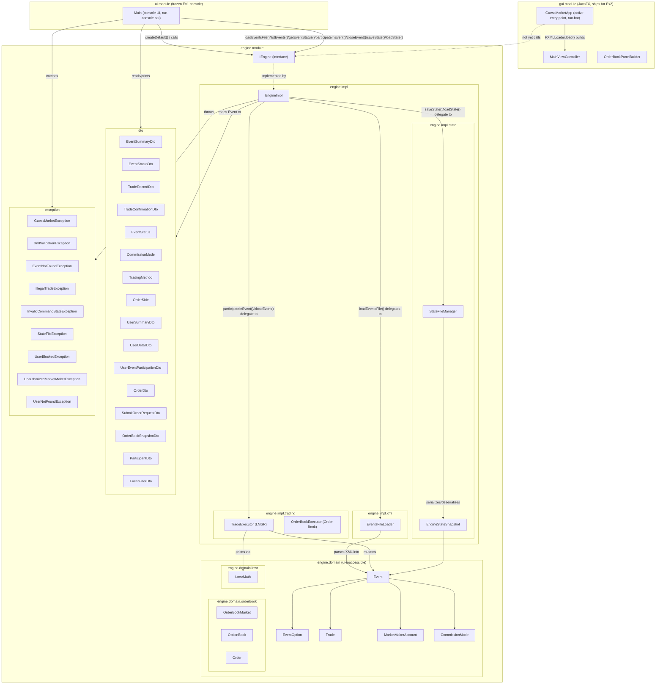

# Architecture

Macro-level documentation per CLAUDE.md Section 7. This file is **append-only** — new stages
add entries here, existing entries are not rewritten away. Grouped by module.

---

## `engine` module

### `engine` package

#### `IEngine` (`engine/src/engine/IEngine.java`)
- **What it is:** An "interface" — a list of method names and signatures with no
  implementation. Any class that wants to act as the engine must provide a body for every
  method listed here. It also carries one `static` method, `createDefault()`, which is a
  small factory that builds the real engine instance.
- **Why it exists:** It's the one boundary `ui` is allowed to depend on. As long as this
  shape doesn't change, `ui` can be swapped out (JavaFX in Ex2, an HTTP client in Ex3)
  without touching the engine, and the engine's internals can change freely without
  breaking `ui`. `createDefault()` exists specifically so `ui` can obtain a working engine
  instance without ever importing `engine.impl.EngineImpl` by name — the constructor call
  lives inside the `engine` module, where referencing its own internal class is legitimate.
- **What it connects to:** Implemented by `engine.impl.EngineImpl`. `ui.Main` calls
  `IEngine.createDefault()` → gets an `IEngine` reference → calls `listEvents()` → gets
  back `List<EventSummaryDto>` → prints one row per event, 1-based. Its method signatures
  reference DTO types from `dto` and exception types from `exception`, and nothing else.
  `participateInEvent`'s third parameter was fixed from the skeleton stage's `double amount`
  to `int shareQuantity` while implementing it — the spec's third argument is a share count,
  not a dollar figure, and nothing depended on the old signature yet.
  **Save/Load-State bonus stage:** two methods added, `saveState(String filePath)` and
  `loadState(String filePath)`, for the bonus feature that persists the *entire* live system
  (every event, all trade history, account balances) to a file of the engine's own choosing —
  explicitly distinct from `loadEventsFile`'s XML format. Both throw `StateFileException`;
  `saveState` also throws `InvalidCommandStateException` (nothing to save if nothing is loaded).
  **Ex2 skeleton stage:** 5 new method stubs added — `listUsers()`, `getUser(String)`,
  `openEvent(int, String)`, `submitOrder(SubmitOrderRequestDto)`, and an
  `EventFilterDto`-taking overload of `listEvents()` (the original zero-arg `listEvents()` is
  kept unchanged, since `ui.Main` still calls it) — empty bodies for now, implemented by
  `EngineImpl` throwing `UnsupportedOperationException`. None of the 7 pre-existing methods'
  signatures were touched. `openEvent` and `submitOrder` are the first methods to take an
  explicit `username` caller-identity parameter, per CLAUDE.md Section 2's "every Ex2 user
  action needs a username" rule — `participateInEvent`/`closeEvent` still lack one, a known,
  deliberately deferred gap for the next stage (Section 6 forbids touching their signatures
  this stage). `openEvent` and `submitOrder` deliberately reuse the existing
  `IllegalTradeException`/`InvalidCommandStateException` for insufficient-funds/wrong-status
  failures rather than introducing new exception types for cases the existing ones already
  shape-match.
  **openEvent implementation stage:** `openEvent`'s return type changed from `void` to
  `EventStatusDto` — the skeleton-stage guess turns out unnecessary once actually
  implementing it, since `EngineImpl` already has `toStatusDto()` to reuse (same accepted
  pattern as `participateInEvent`'s third-parameter type fix). No other signature changed.
  **participateInEvent-username stage:** `participateInEvent` finally gains its `username`
  parameter (positioned after `eventId`, matching `openEvent`'s established convention),
  closing the last deliberately-deferred gap noted above — `closeEvent` still lacks one (out
  of this stage's scope). Also gains `UserNotFoundException`/`UserBlockedException` on its
  throws clause — `UserBlockedException`'s first real use anywhere in the codebase.
  **Order Book core stage:** `submitOrder`'s return type changed from the scaffolded `OrderDto`
  to the new `OrderResultDto` (see that entry — `OrderDto` describes a *resting* order, which a
  fully-filled order doesn't have), and it gained `UserNotFoundException` alongside its existing
  `UserBlockedException`. Its `SubmitOrderRequestDto` parameter is unchanged. No other method's
  signature moved.
  **closeEvent-authorization follow-up:** `closeEvent` gains a `username` parameter and
  `UnauthorizedMarketMakerException` on its throws clause — the last of the four Ex2-era
  trading methods to gain caller identity (`openEvent`, `participateInEvent`, `submitOrder`
  already had it). **Confirmed by manual testing to have been a real, exploitable authorization
  gap, not a theoretical one:** the old `closeEvent(int, int)` had no MM check at all, so
  *any* loaded user could close *any* event — directly contradicting
  `exercise2-requirements.md`'s "only the assigned MM can open or close it." Both `ui.Main`'s
  only call site and `gui`'s new Close control (below) go through the authorized version;
  nothing bypasses it.

### `engine.impl` package

#### `EngineImpl` (`engine/src/engine/impl/EngineImpl.java`)
- **What it is:** The one concrete class that implements `IEngine`. All 5 implemented-so-far
  methods (`loadEventsFile()`, `listEvents()`, `getEventStatus()`, `participateInEvent()`,
  `closeEvent()`) are now fully real — every `IEngine` method Exercise 1 requires.
- **Why it exists:** Gives the project something that can actually be instantiated and
  passed to `ui` as an `IEngine`, so the wiring between modules is provable even before all
  business logic exists. Kept in its own `impl` sub-package (separate from `engine.IEngine`
  itself) specifically so `ui` has no legitimate import path to this class — only to the
  interface.
- **What it connects to:** Implements `engine.IEngine`. `loadEventsFile()` delegates entirely
  to `engine.impl.xml.EventsFileLoader.load()`, which does all path validation, XML parsing,
  and business-rule validation and returns a fully-built `List<Event>` (or throws before
  returning anything); `EngineImpl` only then clears and repopulates its internal
  `Map<Integer, Event>` — so a failed load never touches the previously-loaded valid state.
  `listEvents()` maps each `Event` to an `EventSummaryDto` via the private `toSummaryDto()`
  helper (which now also calls `toDtoCommissionMode()` to translate
  `engine.domain.CommissionMode` into the dto-level `dto.CommissionMode` ui is allowed to see)
  and returns the list, or throws `InvalidCommandStateException` if the map is empty.
  Two private lookup helpers, `findEvent()`/`findActiveEvent()`, back every method that needs
  an event by id: both throw `InvalidCommandStateException` (shared `NO_FILE_LOADED_MESSAGE`
  constant, also now used by `listEvents()`) if nothing has ever been loaded, then
  `EventNotFoundException` if the id is unknown; `findActiveEvent()` additionally throws
  `IllegalTradeException` if the event isn't `ACTIVE` (checked as `!= ACTIVE`, not
  `== CLOSED`, so a future 3rd `EventStatus` value in Ex2 is still rejected correctly without
  touching this code). `getEventStatus()` calls `findEvent()` (works for closed events too)
  then the private `toStatusDto()` mapper, which computes both option prices via
  `LmsrMath.price(...)` and builds trade history newest-first (by reversing `Event`'s
  chronological storage order, not sorting by timestamp). `participateInEvent()` calls
  `findActiveEvent()`, delegates the actual purchase to
  `engine.impl.trading.TradeExecutor.participate()`, then combines the resulting `Trade` and
  the freshly-mutated `Event` into a `TradeConfirmationDto` via `toTradeConfirmationDto()`
  (which itself calls `toStatusDto()` — one shared mapper, three call sites, no duplicated
  DTO-building logic). `closeEvent()` follows the same pattern: `findActiveEvent()`, delegate
  to `TradeExecutor.close()`, then `toStatusDto()` on the now-`CLOSED` event for the return
  value — `toStatusDto()` needed no changes to support this, since it already reads
  `Event.getWinningOption()` (`null` until `close()` sets it) for the DTO's
  `winningOptionName` field. Constructed by `ui.Main` exclusively through
  `IEngine.createDefault()`, never directly.
  **Ex2 skeleton stage:** `toSummaryDto()` and `toStatusDto()` each gained one extra
  hardcoded argument (`TradingMethod.LMSR`, plus `List.of()` twice for `toStatusDto()`'s new
  `orderBooks`/`participants` fields) — a mechanical compile-fix forced by `EventSummaryDto`/
  `EventStatusDto` gaining fields, not a logic change; every event `EngineImpl` currently
  builds is still LMSR-only. 5 new `@Override` stubs added (`listUsers()`, `getUser()`,
  `openEvent()`, `submitOrder()`, `listEvents(EventFilterDto)`), each throwing
  `UnsupportedOperationException` — no business logic yet.
  **Ex2 Users-engine-logic stage:** `listUsers()`/`getUser(String)` are real now, following
  the exact same shape as their event counterparts: a new `Map<String, User> users` field,
  populated atomically alongside `events` inside `loadEventsFile()` (unpacking the new
  `LoadedFile` from `EventsFileLoader.load()`); `listUsers()` guards on `users.isEmpty()` →
  `InvalidCommandStateException`, `getUser()` additionally throws `UserNotFoundException` for
  an unknown name; two new small mappers, `toUserSummaryDto(User)`/`toUserDetailDto(User)`
  (distinct names from `toSummaryDto(Event)`/`toStatusDto(Event)`, avoiding an ambiguous
  same-name overload). `UserDetailDto.activeParticipations` is `List.of()` for now — there is
  no way yet to attribute a trade to a specific user, since `participateInEvent` still has no
  `username` parameter; will populate once that parameter exists, a later stage.
  `findActiveEvent()`'s rejection message was also corrected here: it was written
  ("...is closed and no longer accepts trades.") assuming only two reachable non-ACTIVE
  states existed pre-fix; now that events genuinely start `NOT_STARTED` (see `Event`'s entry
  above), that wording is actively wrong for a freshly-loaded event — reworded to state the
  event's actual status rather than assuming "closed." The underlying `!= ACTIVE` check itself
  needed no change, exactly as anticipated when it was originally written.
  **Save/Load-State bonus, same stage:** `saveState()`/`loadState()` now also
  persist/restore `users`, via `StateFileManager.save(events, users, filePath)` and the new
  `LoadedState` return type — previously only `events` round-tripped at all; see
  `StateFileManager`'s entry below for the mechanics.
  **openEvent implementation stage:** `openEvent(int, String)` is real now, following the
  same `findEvent()`-then-validate shape every other mutating method uses: authorization
  first (`!username.equals(event.getMarketMakerUsername())` → `UnauthorizedMarketMakerException`,
  checked before status so an unauthorized caller never even learns the event's current
  state), then status (`!= NOT_STARTED` → `IllegalTradeException` naming the actual status,
  same wording pattern as `findActiveEvent()`'s own fix above), then affordability
  (`LmsrMath.initialSubsidy(...)` against the MM's `User.getBalance()` — looked up via
  `users.get(username)` with no defensive null-check, since an event's
  `marketMakerUsername` is guaranteed by load-time cross-validation to name a real loaded
  user; `IllegalTradeException` if unaffordable, **before any mutation happens**, so a
  rejected open leaves the MM's balance and the event's account/status all untouched —
  verified directly, not just assumed). On success: `marketMaker.debit(subsidy)`,
  `event.getMarketMakerAccount().credit(subsidy)`, `event.open()`, return `toStatusDto(event)`
  — same mapper every other method already shares, no new DTO needed.
  **participateInEvent-username stage:** `participateInEvent` gains `String username`, after
  the existing `findActiveEvent(eventId)` call (position unchanged): `users.get(username)` →
  `UserNotFoundException` if absent, then `buyer.isBlocked()` → `UserBlockedException` if
  true, both checked before delegating to `TradeExecutor.participate` — a rejection here
  mutates nothing, same shape `openEvent` established. `toUserDetailDto()`'s
  `activeParticipations` is real now (was hardcoded `List.of()`): for each currently-loaded
  event, if the user has ≥1 trade attributed to them (via the new
  `Trade.getBuyerUsername()`), a `UserEventParticipationDto` is built by the new
  `toParticipationDto()` — that user's own trade history newest-first, per-option shares
  held/amount paid summed from their own trades only (LMSR shares aren't transferable, so
  "held" is simply "bought"), total commission paid, and the winning option if closed.
  `profitOrLoss` stays `null` for LMSR, matching this DTO's own skeleton-stage convention
  (reserved for Order Book). Deliberately **not** filtered to `EventStatus.ACTIVE` — a
  `CLOSED` event the user participated in still appears, per
  `exercise2-requirements.md`'s own worked description of what a closed entry shows.
  **Order Book order-submission-UI stage — a real bug, found by manual testing, same category
  as the `toStatusDto`/`toSummaryDto` fix from the Order Book core stage but a separate,
  previously-unfixed occurrence:** `toParticipationDto()` hardcoded `TradingMethod.LMSR`
  unconditionally, so an Order Book event's participation row on the Users tab read "— LMSR"
  regardless of its real method. Now reads `event.getTradingMethod()`. Regression test:
  `EngineImplTest.getUserReportsOrderBookTradingMethodNotHardcodedLmsr`.
  **A second, deeper gap found while tracing this one, not fixed here — flagged rather than
  silently expanded into this bugfix:** participation detection itself
  (`toUserDetailDto()`'s `event.getTradeHistory().stream().anyMatch(... trade.getBuyerUsername()
  ...)`) only ever checks a trade's **buyer**. `Trade` has no `sellerUsername` field at all
  (confirmed by reading `Trade.java`'s fields) — so for an Order Book event, a user who only
  ever *sells* is structurally invisible to this check and never appears in their own
  participation list, even though `OptionBook.holdings` (already used correctly elsewhere, e.g.
  `EngineImpl.toParticipantDtos`) knows perfectly well what they hold. Same root cause as the
  OB-close architectural note already in `CLAUDE.md` Section 8, item 4 — LMSR-shaped,
  trade-history-based logic doesn't generalize to a mechanism where users can sell. Worth its
  own stage, not a quiet addition here: fixing it properly means deciding how
  `optionOneSharesHeld`/`optionOneAmountPaid` etc. should even be computed for Order Book (net
  holdings vs. amount paid via trades only), not just widening one `anyMatch` check.
  **Resolved, next stage — reported via manual testing as a distinct symptom (an MM's own
  initial-allocation shares invisible on their Users-tab participation list), confirmed to be
  the identical underlying gap flagged just above, not a separate one:** no mint exists yet, so
  a share can only ever originate two ways — the MM's initial allocation, or being the buyer in
  a fill (which *does* create a `Trade`) — so "holds shares with zero buyer-attributed trades"
  reduces, in practice, to exactly the MM-allocation case. New `userParticipatesIn(Event,
  String)` extracts the existence check as an OR: the original trade-history check (unchanged,
  what still gates LMSR) **or**, for `ORDER_BOOK`, a nonzero holding of either option via
  `OptionBook.getHolding` — the same source `toParticipantDtos` already used correctly.
  `toParticipationDto` picks its shares from holdings instead of the trade-summed totals for
  Order Book; `tradeHistory`/`totalCommissionPaid` stay trade-sourced either way (real data,
  correct regardless of sourcing model); `optionOneAmountPaid`/`optionTwoAmountPaid` become
  `0.0` for Order Book — decided explicitly, not assumed: a net holding carries no cost-basis
  information (the initial allocation was never "paid for" via a priced trade), so fabricating
  a number there would be worse than a documented `0.0`, matching the spirit of `profitOrLoss`
  already being reserved/null for Order Book. Regression test:
  `EngineImplTest.getUserShowsInitialAllocationAsParticipationEvenWithNoTradesYet`, which
  checks the participation list *before* any trade occurs at all, so it can only pass if the
  entry genuinely came from holdings.
  **Order Book core stage:** `submitOrder` is real (returns `OrderResultDto`), and three
  existing methods gained branches:
  - `openEvent` computes one `openingCost` variable by method — `initial` for Order Book,
    `LmsrMath.initialSubsidy(b)` for LMSR — then runs the *identical* affordability check,
    debit and credit for both. Order Book additionally calls `allocateInitialShares()` and
    bumps both options' outstanding counts by `initial / d` pairs; that is the only place
    outside a mint where an Order Book event's share supply grows.
  - `participateInEvent` **refuses Order Book events** with `IllegalTradeException` ("use
    submitOrder instead"). Without it the rejection happened only *by accident*: an Order Book
    event's `liquidityParameter` is `0`, so `TradeExecutor`'s overflow guard divides by zero,
    gets `Infinity`, and always trips — reporting "purchase quantity too large… try a smaller
    quantity", which misdiagnoses the problem and gives advice that can never work (no
    quantity succeeds, because LMSR participation is meaningless on an order book). Reachable
    in practice: the Events tab used to show a Buy form for every event regardless of method.
  - `closeEvent` **refuses Order Book events** with `IllegalTradeException`.
    `TradeExecutor.close()` is pure LMSR settlement (it pays the winning option's outstanding
    shares out of the MM account); running it on an Order Book event would silently produce
    nonsense rather than fail. Order Book settlement is a later stage — and one that still has
    an open spec question about what happens to resting orders at close (see `CLAUDE.md`
    Section 8), so guarding was the only honest option here.
  - **`toStatusDto`/`toSummaryDto` — a real latent bug fixed, not just an extension.** Both
    hardcoded `TradingMethod.LMSR`, and `toStatusDto` called `LmsrMath.price(...)`
    unconditionally. An Order Book event's `liquidityParameter` is `0`, so that path computed
    `Math.exp(x/0)` = `Infinity`, then `Infinity/Infinity` = **`NaN` for every price shown**.
    They now report the event's actual method, and `toStatusDto` skips LMSR pricing entirely
    for Order Book events — reporting each option's last traded price instead, with the real
    detail in the per-option snapshots. **Decision recorded, since it looks like an
    inconsistency otherwise:** `optionOnePrice`/`optionTwoPrice` are primitive `double`, so for
    an Order Book event `0.0` means *"no trade yet"*, not a real price of zero — unlike
    `OrderBookSnapshotDto`'s boxed `Double` fields, which are correctly `null` when
    unavailable. They were deliberately **not** boxed to match: the frozen `ui.Main` reads them
    via `formatDecimal(double)` and would NPE on a null (and per the lecturer needn't work
    against Ex2 files at all), while `MainViewController`'s detail panel needs a full
    `tradingMethod` branch in the Order Book UI stage regardless — at which point it reads
    `orderBooks[i].lastPrice()` and stops reading these two fields for OB events entirely, so
    any partial null-safety added now would be thrown away. Order Book consumers should read
    the snapshots, not these fields. It also populates `orderBooks`
    (resting orders in priority order plus LAST/BID/ASK/MID/SPREAD, where **MID and SPREAD stay
    `null` unless both sides have liquidity** — an empty side makes them undefined, not zero,
    exactly as the appendix requires) and `participants` (one row per user holding shares of
    either option, valued at that option's last traded price). Both stay empty for LMSR events.

### `engine.domain` package

Holds the engine's real internal state — plain Java classes, private fields, constructor +
getters only, no behavior yet. Nested under `engine` (like `engine.impl`) rather than
top-level, specifically because `ui` must never see these — only `dto` and `exception` are
the intentionally top-level, `ui`-facing packages.

#### `CommissionMode` (`engine/src/engine/domain/CommissionMode.java`)
- **What it is:** An enum with two values, `ON_PURCHASE` and `ON_CLOSE`.
- **Why it exists:** Represents which of the two commission-collection modes (Section 4)
  an event uses, instead of a loose `String` or `boolean`.
- **What it connects to:** Stored as a field on `Event`. Read by
  `engine.impl.trading.TradeExecutor`'s `participate()`/`close()` to decide when commission is
  charged.

#### `EventOption` (`engine/src/engine/domain/EventOption.java`)
- **What it is:** A small class holding a name and a running `sharesOutstanding` count — one
  of an event's two outcomes (what the XML calls a `GM-option`).
- **Why it exists:** Every event needs exactly two of these; giving the outcome its own
  type (rather than a bare `String`) is what let `sharesOutstanding` + `addShares()` get
  attached directly to it once LMSR trading needed somewhere to track "how many shares of
  *this* option have been bought" — the number `LmsrMath.price()`/`purchaseCost()` need as
  each option's `q`.
- **What it connects to:** Held as `optionOne`/`optionTwo` fields on `Event` (two named
  fields, not a list — so "exactly two options" is structural, not just validated at
  runtime). Referenced by `Trade.option` to record which option a purchase was for.
  `addShares()` is called by `engine.impl.trading.TradeExecutor.participate()`; nothing
  validates its input (must be positive) since that's `TradeExecutor`'s job, not this class's.
  **Save/Load-State bonus stage:** now `implements Serializable` (+ `serialVersionUID`), so
  `engine.impl.state.StateFileManager` can write/read it as part of an `Event`'s object graph.

#### `Trade` (`engine/src/engine/domain/Trade.java`)
- **What it is:** A record of one executed purchase — which option, how much, at what
  price, how much commission, and when.
- **Why it exists:** The engine's own internal memory of trade history; its field shape
  mirrors `dto.TradeRecordDto` on purpose, since mapping one to the other is exactly what
  `EngineImpl.toTradeRecordDto()` does.
- **What it connects to:** Held inside an `Event`'s `tradeHistory` list via `Event.addTrade()`.
  Created by `engine.impl.trading.TradeExecutor.participate()` — `pricePerShare` holds the
  share cost alone (no commission), `commissionPaid` and `totalPaid` are tracked as separate
  fields, so "price paid" in trade-history display can mean share-cost-alone without losing
  the other two numbers. Mapped to `dto.TradeRecordDto` by `EngineImpl.toTradeRecordDto()`
  (never handed to `ui` directly, per the deep-DTO rule in CLAUDE.md Section 2).
  **Save/Load-State bonus stage:** now `implements Serializable` (+ `serialVersionUID`); its
  `option` field aliases the same `EventOption` instance the owning `Event` holds, and Java's
  built-in serialization preserves that reference identity across a save/load round-trip
  (verified explicitly by `SaveLoadStateTest.roundTripsEveryFieldAndPreservesObjectIdentity()`).
  `timestamp`'s type, `java.time.LocalDateTime`, is already `Serializable` in the JDK.
  **participateInEvent-username stage:** gained a 7th field, `buyerUsername` — the same
  null-on-old-`.gmstate`-files safety already established for `User`/`EngineStateSnapshot`
  (`serialVersionUID` stays `1L`; an old saved `Trade` simply deserializes with
  `buyerUsername == null`, so `EngineImpl.toParticipationDto()`'s `.equals()` check against a
  known-non-null username treats that correctly as "unattributed," never NPEs). Set by
  `TradeExecutor.participate()` from the resolved `User` it now receives
  (`buyer.getName()`), not looked up separately.

#### `MarketMakerAccount` (`engine/src/engine/domain/MarketMakerAccount.java`)
- **What it is:** A small class holding two numbers: the account's current balance and its
  lifetime total commission collected.
- **Why it exists:** Each event has its own MM account (Section 4) that subsidy is paid
  into, commissions are collected into, and payouts are made from; keeping the running
  balance and the lifetime commission total as separate fields matches the "event trading
  status" view needing to show both independently.
  **Save/Load-State bonus stage:** now `implements Serializable` (+ `serialVersionUID`); a
  negative `balance` serializes/deserializes as an ordinary `double`, no special handling
  needed.
- **What it connects to:** Held as the `marketMakerAccount` field on `Event`. `credit()` and
  `addCommissionCollected()` are called by `engine.impl.trading.TradeExecutor.participate()`
  on every purchase; `debit()` is called by `TradeExecutor.close()` for the winning payout.
  No validation inside any mutator — all three are simple `+=`/`-=` adjustments; the caller is
  responsible for passing sensible values. `debit()` never clamps at 0 — CLAUDE.md Section 4
  explicitly allows (expects) the balance to go negative when the MM pays out more than it
  collected.

#### `Event` (`engine/src/engine/domain/Event.java`)
- **What it is:** The engine's real internal representation of one Guess Market event —
  everything `Event Trading Status` and the other commands need to know: id, name,
  description, its two options, commission config, its LMSR liquidity parameter (the spec's
  `b`), its MM account, current status, and trade history.
- **Why it exists:** This is the actual domain object CLAUDE.md Section 2 says must never
  cross the `engine`→`ui` boundary directly; every value `ui` sees is mapped from this into
  a `dto` type first (e.g. `EngineImpl.toSummaryDto` builds an `EventSummaryDto` from one).
  Reuses `dto.EventStatus` for its `status` field rather than a separate domain-only enum,
  since that enum has no behavior and isn't the kind of mutable state the deep-DTO rule
  targets. `description` and `liquidityParameter` were added in the Load-XML stage because
  parsing the file is the only time this data is ever available — later commands (price
  display, trading) read it back off the already-built `Event`, never by re-parsing XML.
- **What it connects to:** Built by `engine.impl.xml.EventsFileLoader.buildEvent()` from a
  parsed `GM-event` XML element, one fresh instance per loaded event (no reuse across
  loads). Read by `EngineImpl.toSummaryDto()`/`toStatusDto()` to build the DTOs `ui` actually
  sees. Its `getTradeHistory()` returns an unmodifiable view of its internal `List<Trade>` so
  nothing outside `Event` can mutate engine state through the reference — the only way to add
  a trade is the `addTrade(Trade)` method. Two more methods, `getOption(int)` and
  `getOtherOption(int)`, resolve 1→`optionOne`/2→`optionTwo` (and the reverse); both are
  intentionally "dumb" — no validation that the number is 1 or 2 — because
  `engine.impl.trading.TradeExecutor` is where every trading-rule validation is centralized,
  and callers here are required to have already checked. `status` is no longer `final`: the
  new `close(EventOption winningOption)` method is the *only* place it ever changes, setting
  it to `CLOSED` and recording `winningOption` (a new field, `null` until `close()` runs, read
  back by `getWinningOption()`) — called exclusively by
  `engine.impl.trading.TradeExecutor.close()`.
  **Save/Load-State bonus stage:** now `implements Serializable` (+ `serialVersionUID`), the
  key retrofit that makes the save/load-state bonus feature possible. `winningOption` aliases
  the same instance as `optionOne` or `optionTwo` (set by `close()`), and this reference
  identity survives a save/load round-trip intact because
  `engine.impl.state.StateFileManager` writes an entire event graph in one `writeObject` call.
  **Ex2 Users-engine-logic stage:** two changes. (1) `EventsFileLoader.buildEvent()` now
  constructs every event as `NOT_STARTED` instead of `ACTIVE` — real lifecycle gating,
  deferred since `dto.EventStatus.NOT_STARTED` was first added at the skeleton stage. No other
  code needed to change: `EngineImpl.findActiveEvent()`'s existing `!= ACTIVE` check already
  correctly rejects `NOT_STARTED` too (only its message needed a wording fix), and
  `engine.impl.trading.TradeExecutor` has no status logic of its own at all — it only ever
  runs against an event `findActiveEvent()` already vetted. (2) A new field,
  `marketMakerUsername` (`null` until assigned), plus `getMarketMakerUsername()` and a named
  mutator, `assignMarketMaker(String)` — mirrors `close()`'s pattern (one specific transition
  method, not a generic setter). Assigned exactly once, by
  `EventsFileLoader`'s new `GM-users`/`GM-market-maker` cross-referencing pass, immediately
  when a user's MM reference to this event is validated.
  **openEvent implementation stage:** gained `open()`, mirroring `close()`'s exact pattern —
  the only way status transitions `NOT_STARTED` → `ACTIVE`, called exclusively by
  `EngineImpl.openEvent()` after authorization/status/affordability all pass.
  **Order Book core stage:** gained `tradingMethod` (never null) and `orderBook` (an
  `engine.domain.orderbook.OrderBookMarket`, **null for LMSR events**) — composition, not a
  subclass, so `Event` stays one type everywhere. The two method-specific fields are exact
  mirrors of each other: `liquidityParameter` is meaningful only for LMSR, `orderBook` only for
  Order Book, and every reader branches on `getTradingMethod()` first. `liquidityParameter`
  was deliberately left inline rather than moved into a symmetric `LmsrMarket` object — the
  symmetric version is tidier but would touch `TradeExecutor`, three `EngineImpl` mappers,
  `EventsFileLoader` and both test files, all working and tested, for a cosmetic gain.
  `orderBook` is also null on `.gmstate` files written before Order Book existed, the same
  null-safety already relied on for `Trade.buyerUsername` and `EngineStateSnapshot.users`.

#### `User` (`engine/src/engine/domain/User.java`) — Ex2 Users-engine-logic stage, new
- **What it is:** One registered user's account — a `name` and a `balance`, plus a derived
  `isBlocked()` (`balance < 0`, computed, not a separately stored flag). Matches the existing
  domain-class convention exactly: `implements Serializable`, `serialVersionUID`, fields set
  once via the constructor.
- **Why it exists:** The engine's real internal representation of a `GM-user`, kept out of
  `dto` for the same reason `Event` is — `ui` must never see domain objects directly, only the
  `UserSummaryDto`/`UserDetailDto` shapes `EngineImpl` maps them into.
- **What it connects to:** Built by `EventsFileLoader`'s new `GM-users` parsing pipeline
  (`extractUsers()`/`buildUser()`), one fresh instance per `GM-user` element, no reuse across
  loads (same lifecycle as `Event`). Held in `EngineImpl`'s new `Map<String, User> users`
  field, keyed by name.
  **openEvent implementation stage:** gained its first balance-mutating method,
  `debit(double)` — matching `MarketMakerAccount.debit()`'s exact naming/doc-comment style
  (never clamped). Called by `EngineImpl.openEvent()` to move the LMSR subsidy out of the
  MM's balance. No `credit()` yet — nothing calls it, same minimal-scope discipline this
  class started with.

### `engine.domain.lmsr` package

#### `LmsrMath` (`engine/src/engine/domain/lmsr/LmsrMath.java`)
- **What it is:** A class with no instances (only `static` methods) implementing the two LMSR
  formulas from `docs-reference/lmsr-appendix.md`: the cost function `C(q1, q2)` and the price
  of one option. A third method, `purchaseCost`, gives the cost of buying more shares as
  `cost(after) - cost(before)`.
- **Why it exists:** Isolates the actual pricing math as pure functions of numbers — no
  dependency on `Event` or anything else — so it can be tested in isolation (see
  `LmsrMathTest`) and reused later by trading logic without that logic needing to know *how*
  the math works, only that it can call `LmsrMath.price(...)`/`LmsrMath.purchaseCost(...)`.
  Deliberately has no relationship to `Event` via inheritance or otherwise: trading logic will
  *use* these methods (composition), not extend or implement anything LMSR-shaped, keeping the
  door open for Ex2's Order Book to be an entirely separate, unrelated mechanism.
- **What it connects to:** Called by `engine.impl.trading.TradeExecutor.participate()`
  (`purchaseCost()` for the trade's cost) and by `EngineImpl.toStatusDto()` (`price()` for
  both options' current prices). Verified against the appendix's worked example by
  `engine/test/engine/domain/lmsr/LmsrMathTest.java`, run via the JUnit Platform Console
  Standalone jar in `lib/` (test-only dependency — never bundled into `engine.jar`). `test.bat`
  at the project root compiles and runs it.
  **openEvent implementation stage:** gained a fourth method, `initialSubsidy(int
  liquidityParameter)` — `C(0,0) = b · ln(2)`, moved (not duplicated) from a private helper
  that used to live in `EventsFileLoader`. Needed in a second place now (`EngineImpl.openEvent`),
  so it belongs in this shared math utility rather than being copy-pasted into both callers.

### `engine.domain.orderbook` package — Order Book core stage, new

Isolates every Order Book concept in its own package, exactly as `engine.domain.lmsr` isolates
LMSR. The two mechanisms share **no** pricing code: LMSR prices from a curve, an order book
prices from whatever counterparties are actually resting. All three classes are `Serializable`
(+ `serialVersionUID = 1L`) because they hang off `Event`, which `StateFileManager` serializes.

#### `Order` (`engine/src/engine/domain/orderbook/Order.java`)
- **What it is:** One resting order — username, side, price, remaining quantity, and a
  `sequence` number. Quantity is the one mutable field: it shrinks via `reduceQuantity()` as
  the order is partially filled, and the order leaves its book at zero.
- **Why it exists:** The unit of book state. `dto.OrderDto` is its display-side counterpart —
  same four visible fields, minus the sequence, which is internal bookkeeping `ui` never needs.
- **What it connects to:** Held in an `OptionBook`'s bid or ask list; created by
  `OrderBookExecutor` when an order (or a remainder of one) rests. **`sequence` is a monotonic
  counter from `OrderBookMarket`, deliberately not a timestamp** — `LocalDateTime.now()` can
  collide at millisecond resolution, which would silently make time priority between two
  equally-priced orders non-deterministic.

#### `OptionBook` (`engine/src/engine/domain/orderbook/OptionBook.java`)
- **What it is:** One option's independent book: a bid list, an ask list, its last traded
  price (`null` until the first trade), and a `username → shares` holdings map.
- **Why it exists:** The spec gives each option its own book; this is that, plus the holdings
  that make `ParticipantDto` and the sell-requires-shares rule possible. Holdings live per
  option because that's exactly the granularity both of those need.
- **What it connects to:** **Both sides are kept sorted best-first** (bids price-DESC, asks
  price-ASC, each tie-broken by `sequence` ASC), so index 0 is always the best price and
  `OrderBookExecutor`'s matching loop can stay side-agnostic via `oppositeSideFor()`.
  Deliberately a sorted `ArrayList` rather than a `PriorityQueue`: `EngineImpl` renders the
  whole book *in priority order* on every `getEventStatus`, which a `PriorityQueue` cannot
  iterate, and `n` here is a handful of orders — so the O(n) sorted insert costs nothing while
  keeping the matching loop readable. `getBids()`/`getAsks()`/`getHoldings()` hand back
  unmodifiable views so nothing outside can mutate a book by holding its list.

#### `OrderBookMarket` (`engine/src/engine/domain/orderbook/OrderBookMarket.java`)
- **What it is:** An Order Book event's whole trading state: its `GM-order-book` config
  (`initial`, `d`, `allowMint`), one `OptionBook` per option, and the `nextSequence()` counter.
- **Why it exists:** Composed onto `Event` as a single nullable field rather than scattering
  four Order-Book-only fields across it, and rather than subclassing `Event` — there's no real
  is-a relationship to justify inheritance (CLAUDE.md Section 5), and a subclass would fracture
  `Map<Integer, Event>`, `StateFileManager`, `LoadedFile`, and every existing mapper. Mirrors
  how `MarketMakerAccount` is *already* a composed sub-object of `Event`.
- **What it connects to:** `Event.getOrderBook()` (null for LMSR events — the mirror image of
  `liquidityParameter` being meaningless for Order Book ones). `getMaxOrderPrice()` returns
  `d - 0.01`, the spec's price ceiling. `allocateInitialShares()` is the MM's **initial
  allocation** at open — `initial / d` share-pairs, one share of each option per pair — kept a
  deliberately distinct code path from peer-to-peer mint, as the appendix warns. Holding *both*
  books here is also what will let the later mint stage pair a bid on one option against a bid
  on the other **without restructuring anything**.

### `engine.impl.xml` package

#### `EventsFileLoader` (`engine/src/engine/impl/xml/EventsFileLoader.java`)
- **What it is:** A class with no instances (only `static` methods) that turns a file path
  into a validated list of `engine.domain.Event` objects. It's the entire "read an events
  XML file" pipeline in one place: check the path, parse the XML, validate every business
  rule, and build domain objects — or throw `XmlValidationException` before building
  anything if any step fails.
- **Why it exists:** Keeps `EngineImpl.loadEventsFile()` a thin one-line delegator instead of
  a god-method, and keeps every part of "how do we read this XML file" (including the
  `commission`/`comision` tag-name mismatch between the spec text and the lecturer's real
  files — see `findCommissionElement()`) isolated in one small package nobody outside
  `engine.impl` can import. Uses plain JDK DOM parsing (`javax.xml.parsers`), not JAXB — no
  external dependency needed at this file scale, avoiding real JAR-packaging risk on a
  plain multi-module IntelliJ project with no Maven/Gradle.
- **What it connects to:** Called by `EngineImpl.loadEventsFile()`. Its `load()` entry point
  returns `List<Event>` on success or throws `exception.XmlValidationException` with a
  specific message per violation (bad path/extension, missing file, **zero `GM-event`
  elements anywhere in the document**, duplicate id, commission out of `[0,90]`, wrong
  `GM-option` count). On success it also computes each event's initial LMSR subsidy
  (`b · ln(2)`, per `docs-reference/lmsr-appendix.md`'s worked example) and constructs each
  event's `MarketMakerAccount` with that as its starting balance.
  - **Bug found and fixed during the Day 7 integration pass:** `extractEvents()` originally
    used `document.getElementsByTagName("GM-event")` with no check that it found anything —
    `getElementsByTagName` searches the whole document tree unscoped by root element, so a
    well-formed XML file with the *wrong* structure entirely (e.g. the reference XSD schema
    itself, root `<xs:schema>`, no `GM-event` anywhere) silently produced an **empty**
    `List<Event>` instead of an error. `EngineImpl.loadEventsFile` then "succeeded" at loading
    zero events, and the very next `listEvents()` call reported "no file loaded" — a
    misleading, silently-broken success rather than a clear rejection. Fixed with one check
    (`eventNodes.getLength() == 0` → throw `XmlValidationException`) before the extraction
    loop. Covered by `test_files/error-7-no-events.xml` (well-formed `Guess-Market` root, empty
    `GM-events` wrapper) as the on-spec regression case, in addition to the schema file itself
    as the edge case that originally surfaced it.
  - **Ex2 Users-engine-logic stage:** `load()`'s return type changed from `List<Event>` to a
    new record, `LoadedFile(events, users)` (see below) — the loader now also parses and
    cross-validates `GM-users`/`GM-market-maker`, per CLAUDE.md Section 2/4: unique user
    name, `initial-cash > 0`, every MM event reference must exist, every event must have
    exactly one MM. All fold into the existing `XmlValidationException` with a specific
    message per case — no new exception types, matching the pattern already established by
    the earlier Order Book NPE fix (`buildEvent()`'s `lmsrElement == null` guard, just above
    this note in the source). MM event-refs are validated **eagerly, per-reference**, not
    deferred to a final pass: an unknown id or an event already claimed by an earlier user
    both throw immediately inside `assignMarketMakerEvents()`; only the "zero MM" case
    (nobody ever claimed the event) needs the separate final pass,
    `requireEveryEventHasAMarketMaker()`, run once after every user is processed. One
    consequence worth recording since it contradicts an earlier assumption written into the
    implementation plan: `test_files/ex2-error-3.xml` was expected to exercise this
    eager-vs-final ordering (it has both a dangling MM reference *and* a resulting zero-MM
    event), but it actually surfaces neither message — it also contains a `GM-order-book`
    event, and `extractEvents()` (which walks all events before `extractUsers()` ever runs)
    hits that pre-existing Order Book guard first. Verified with a purpose-built fixture
    instead: `test_files/ex2-users-lmsr-only.xml` (LMSR-only, includes a user who is MM for
    multiple events at once) plus a set of small synthetic negative-case files exercised
    through a throwaway harness, one per validation rule.
  - **Order Book core stage — the rejection guard below is now gone.** `buildEvent()` branches
    on which child `GM-method` actually contains: `GM-LMSR` → parse `b` as before;
    `GM-order-book` → parse `@initial`/`@d`/`@allow-mint` into an `OrderBookMarket`; **neither**
    → still a hard `XmlValidationException`, since that's a genuinely malformed file (the guard
    changed target rather than simply disappearing). Two new business-rule checks the XSD
    doesn't make: `d > 0` (a non-positive `d` would give a *negative* price ceiling of
    `d - 0.01` and divide-by-zero on `initial / d`) and `initial >= 0` (the schema explicitly
    permits `initial="0"`, so only negative is invalid). Attribute parsing goes through a
    helper that reports a specific message instead of leaking a raw `NumberFormatException`.
  - **openEvent implementation stage — correction to this entry's own "What it connects to"
    bullet above:** `buildEvent()` no longer computes the initial LMSR subsidy or funds
    `MarketMakerAccount` with it at load time — that was an Ex1 leftover from when events
    started `ACTIVE` immediately with no separate "open" step. Every event's
    `MarketMakerAccount` now starts at `0.0`; the subsidy only moves (from the MM's own
    `User.balance`) when `EngineImpl.openEvent()` actually opens it. The subsidy formula
    itself moved to `LmsrMath.initialSubsidy()` (see that class's entry above) since
    `EngineImpl.openEvent` needed it too — no longer duplicated, and no longer computed here
    at all.

#### `LoadedFile` (`engine/src/engine/impl/xml/LoadedFile.java`) — Ex2 Users-engine-logic stage, new
- **What it is:** `record LoadedFile(List<Event> events, List<User> users)` — the result of one
  fully cross-referenced, fully validated file load.
- **Why it exists:** `load()` needs to hand back two collections now instead of one, and this
  package is purely `engine.impl.xml`-internal (never crosses the `IEngine` boundary), so a
  small local record is simpler than reshaping `EngineImpl`'s own map types around it.
- **What it connects to:** Returned by `EventsFileLoader.load()`; unpacked by
  `EngineImpl.loadEventsFile()` into its `events`/`users` maps in one atomic replace.

### `engine.impl.trading` package

#### `TradeExecutor` (`engine/src/engine/impl/trading/TradeExecutor.java`)
- **What it is:** A class with no instances (only `static` methods) with two entry points
  against an already-resolved `Event`: `participate()` (buys shares — validates the request,
  runs the LMSR cost/commission math, mutates the event's state, records the trade) and
  `close()` (declares the winning option, pays out, settles commission, marks the event
  closed). Both share one private `validateOptionNumber()` helper.
- **Why it exists:** Same shape and reasoning as `engine.impl.xml.EventsFileLoader` — keeps
  `EngineImpl.participateInEvent()`/`closeEvent()` thin delegators instead of god-methods, and
  gives trading-rule validation (bad option number, non-positive share quantity, a share
  quantity large enough to overflow the LMSR math, and — via `EngineImpl.findActiveEvent()`
  before either method is even called — a closed event) exactly one home. Takes an `Event`
  object, not an id: it never touches `EngineImpl`'s `events` map, so event lookup/existence/
  active-state checking stays entirely `EngineImpl`'s job.
- **What it connects to:** Called by `EngineImpl.participateInEvent()`/`closeEvent()` after
  `findActiveEvent()` has already confirmed the event exists and is `ACTIVE`.
  `participate()` first checks that the *resulting* share count for the chosen option, divided
  by the event's liquidity parameter, stays at or under `MAX_SAFE_SHARES_OVER_LIQUIDITY` (700 —
  comfortably under `Math.exp`'s ~709.78 overflow point) — rejecting with `IllegalTradeException`
  before touching any state if not, since `Math.exp` overflows to `Infinity` silently rather than
  throwing, and that `Infinity` would otherwise propagate all the way to `ui` as a garbage
  `Infinity`/`NaN` display (found and fixed during a Day 7+ follow-up: 100,000 shares against
  b=100 used to "succeed" with exactly that garbage). Only then computes cost via
  `LmsrMath.purchaseCost()`, applies commission only when `CommissionMode.ON_PURCHASE` (0 under
  `ON_CLOSE`), then calls `EventOption.addShares()`, `MarketMakerAccount.credit()`,
  `MarketMakerAccount.addCommissionCollected()`, and `Event.addTrade()`. `close()` reads the
  winning `EventOption.getSharesOutstanding()` as the payout owed, computes commission only when
  `CommissionMode.ON_CLOSE` (already collected per-trade under `ON_PURCHASE`, so 0 here), calls
  `MarketMakerAccount.addCommissionCollected()` (when non-zero) and
  `MarketMakerAccount.debit(payoutOwed - commissionAmount)`, then `Event.close(winningOption)` —
  both mutate the same `Event` object `EngineImpl` already holds a reference to. `participate()`
  returns the new `Trade`, which `EngineImpl.toTradeConfirmationDto()` combines with a
  freshly-built `EventStatusDto` (via `toStatusDto()`) into the `TradeConfirmationDto` `ui`
  receives; `close()` returns nothing — `EngineImpl.closeEvent()` calls `toStatusDto()` on the
  same, now-`CLOSED` `Event` afterward. Covered by
  `engine/test/engine/impl/trading/TradeExecutorTest.java` (commission math for both modes and
  both operations, the negative-balance-is-not-clamped case, the validation-rejection paths,
  and — for the overflow guard specifically — both the exact 100,000-share/b=100 case that
  surfaced the bug and a just-under-the-threshold case confirming legitimate large purchases
  still work), run by the same `test.bat` as `LmsrMathTest`.
  **participateInEvent-username stage:** `participate()` gains a `User buyer` parameter — the
  *resolved* object, not a username string, matching this class's own stated principle of
  never looking things up itself (same as it already receives a resolved `Event`, never an
  id). After the existing cost/commission math produces `totalPaid`, one new line,
  `buyer.debit(totalPaid)` — the *same* value already credited to the `MarketMakerAccount`
  a line above it, not recomputed, so the two sides can never drift apart (verified directly
  against source, not just asserted, when this was implemented). No affordability check here:
  per CLAUDE.md Section 4 the trade completes even if it leaves the buyer negative;
  `User.isBlocked()` (already derived, no new state) picks that up automatically from that
  point on. The new `Trade` records `buyer.getName()` as its `buyerUsername`.
  **Winner-payout fix — a severe bug, found by manual testing.** `close()` gains a
  `Map<String, User> users` parameter and a new private `payWinners()`. Until this fix
  **`close()` credited no user's balance anywhere** — it had no `User` parameter and no access
  to any user object at all. It was Ex1-era code, written before Users existed, that settled
  purely against `MarketMakerAccount`: the payout was debited from the event account and then
  **went nowhere, destroying the money.** Winners whose purchases had pushed them negative
  stayed negative and permanently `isBlocked()` even after winning. `Trade.buyerUsername` had
  existed since the participateInEvent-username stage, but nothing at close time read it.
  `payWinners()` now walks the event's trade history, and for every trade on the winning option
  credits that trade's buyer `quantity` (each winning share settles at 1.0), less that trade's
  own share of the commission under `ON_CLOSE`. **This is exactly the amount already debited
  from the account** — summed over the winning option's trades, `Σquantity` *is*
  `winningOption.getSharesOutstanding()`, so the existing debit and the new credits are equal by
  construction, with nothing recomputed and no rounding drift (the same discipline
  `participate()` uses with its single shared `totalPaid`). Trades are matched to the winning
  option by **reference identity, not `equals`** — a `Trade`'s option always aliases the event's
  own `EventOption`, which `SaveLoadStateTest` already asserts survives serialization. A trade
  with a null `buyerUsername` (from a `.gmstate` written before that field existed) is skipped
  rather than failing the close, the same tolerance documented for `EngineStateSnapshot.users`.
  **Note on the diagnostic evidence:** the symptom that surfaced this was an event whose account
  balance exactly equalled its commission collected, which looked like "the payout was never
  deducted" — it wasn't. Subsidy + share proceeds exactly fund an LMSR payout by design, so the
  residual *is* the commission; the account was always correct, and only the payout's
  destination was missing. Covered by six new `TradeExecutorTest` cases, including
  `closeConservesTotalMoneyAcrossAccountAndUsers` — the money-conservation assertion that would
  have caught this originally, and the reason it is worth more than the per-case assertions.
  **Leftover-subsidy follow-up fix, same session:** a second gap in `close()`, per
  `exercise2-requirements.md`'s "for LMSR only, any leftover subsidy in the event account also
  returns to the MM." New private `returnLeftoverSubsidyToMarketMaker()`, called after
  `payWinners()`. **"Leftover," precisely:** `payWinners()` never touches
  `MarketMakerAccount.balance` (only individual `User` balances), and the payout aggregate was
  already removed from the account earlier in `close()` — so by this point the account's
  balance *already is* the leftover; nothing else is pending. It is read once and debited back
  verbatim, which is also why the account lands at **exactly** `0.0` afterward, not an
  approximation: `x − x` is always exactly `0.0` in IEEE 754 for a finite `x` that is never
  recomputed. **Cannot double-count when the MM also trades in their own event, by
  construction:** `payWinners()`'s per-trade credits (MM's own included, resolved through the
  same `users.get(buyerUsername)` as any other buyer, no special-casing) and the leftover credit
  draw from two pools that structurally never overlap — the aggregate payout debit happens once,
  before either step runs, so nothing either step does afterward can feed back into what the
  other reads. Tested via `marketMakerWhoIsAlsoAWinningBuyerIsNotDoubleCountedOrShortedByLeftover`,
  which proves this algebraically (the MM's final balance equals her pre-close balance plus the
  *entire* pre-close account balance minus only what went to the other winner) rather than by
  hand-deriving LMSR curve numbers.
  **This fix broke four of FIX 1's own pre-existing tests**, each for the identical reason:
  none of them included a market-maker `User` in the map passed to `close()`, so once the
  leftover started actually being returned, `users.get(event.getMarketMakerUsername())`
  resolved to `null` (the domain `Event`'s `marketMakerUsername` field defaults to `null` unless
  `assignMarketMaker()` is explicitly called — `newEvent()`'s test helper never had reason to
  call it before this fix existed) and the leftover credit was silently skipped, leaving those
  tests asserting the old, now-incorrect "money stays in the account" behavior. All four were
  updated, not just patched: `onCloseCommissionIsDeductedFromPayoutAtCloseTime` and
  `onPurchaseFullPayoutIsDebitedAtCloseWithNoAdditionalCommission` now assert the same residual
  value lands on the MM's own balance instead of the account; `closeConservesTotalMoneyAcrossAccountAndUsers`
  gained a market maker to its conservation sum; and `balanceCanGoNegativeAndIsNotClamped` was
  renamed `marketMakerAbsorbsANegativeLeftoverAndIsNotClamped` — its original point (a balance
  can legitimately go negative, unclamped) no longer applies to the account, which is now always
  zeroed by design, but applies to the MM's own balance instead, where an unfavorable leftover
  now actually lands.
  **New test file, `engine/test/engine/impl/EngineImplTest.java`** — no `EngineImplTest` existed
  before this (a gap flagged repeatedly across this session; every `EngineImpl` method-routing
  guard had only ever been checked by throwaway harnesses). Deliberately **not** a general
  backfill — its own class comment says so — it holds exactly the two tests that structurally
  need the real engine rather than `TradeExecutor` in isolation:
  `fullCycleConservesTotalMoneyAcrossOpenTradeAndClose` (the full `openEvent` →
  `participateInEvent` → `closeEvent` cycle, through `IEngine`, against the existing
  `test_files/ex2-small.xml` fixture — conservation holds across the *whole* lifecycle, not just
  `close()` alone, since `openEvent` also moves money between a `User` and the event account)
  and `closeEventStillRejectsOrderBookEventsAfterLeftoverFix` (a permanent regression test for
  the OB-close guard from the Order Book core stage, which had none before). The broader
  "`EngineImpl` has no test suite" gap stays open and visible, not accidentally masked.
  **Save/Load-State bonus stage:** `saveState()` guards on `events.isEmpty()` (same
  `InvalidCommandStateException` + `NO_FILE_LOADED_MESSAGE` pattern `findEvent()` already uses),
  then delegates the actual serialization to `engine.impl.state.StateFileManager.save()`.
  `loadState()` follows `loadEventsFile()`'s exact atomic-replace shape: `StateFileManager.load()`
  builds the entire new `Map<Integer, Event>` off to the side and throws before returning
  anything on any failure, so `EngineImpl` only clears and repopulates its live `events` field
  after the new state is fully known-good — a failed load never touches previously-loaded state,
  identical guarantee to Command 1.

#### `OrderBookExecutor` (`engine/src/engine/impl/trading/OrderBookExecutor.java`) — Order Book core stage, new
- **What it is:** The Order Book counterpart to `TradeExecutor`: one `submit()` entry point
  that validates an order, matches it against the book, and rests any remainder. Returns one
  `Trade` per fill, in execution order.
- **Why it exists:** Same reasoning that keeps `TradeExecutor` separate from `EngineImpl` —
  `EngineImpl.submitOrder()` stays a thin lookup-and-delegate, and every Order Book trading
  rule lives in exactly one place. Deliberately a *separate class* from `TradeExecutor` rather
  than a branch inside it: the two share no pricing math whatsoever, so merging them would
  produce a class that's really two classes wearing a trenchcoat.
- **What it connects to:** Called by `EngineImpl.submitOrder()` after it has resolved the
  event (exists / `ACTIVE` / actually Order Book) and the user (exists / not blocked). Like
  `TradeExecutor` it takes already-resolved domain objects and never looks events up itself —
  with one honest exception: it receives the `Map<String, User> users` because a fill has *two*
  parties, and the resting counterparty can only be reached by the username on their order.
  - **The matching rule, stated twice by the appendix and enforced in one place here:** every
    fill executes at the **resting order's own price**, never the incoming order's limit. The
    limit is only a boundary on which prices the incoming order will accept — which is why a
    marketable order can do better than its own limit (the appendix's Zoe walks two bids at
    `$0.50` and `$0.48` against a `$0.45` floor and nets `$14.80`).
  - **Commission follows the buyer of each fill, not the submitter.** An incoming *sell*
    therefore pays none itself while each resting buyer it fills against pays theirs. Confirmed
    against the appendix's own numbers, where the seller receives the full gross. Charged only
    under `ON_PURCHASE`; `ON_CLOSE` settles at close instead.
  - **Unlike LMSR, the event account is not the counterparty** — money moves peer-to-peer
    between the two users, and `MarketMakerAccount` only ever sees commission (plus the MM's
    `initial` at open). A fill also **never changes share supply**; it only transfers existing
    holdings between users.
  - **Validation, all before any mutation:** option number 1 or 2, positive quantity, price in
    `(0, d - 0.01]`, and — for a sell — that the seller actually holds the shares. That last
    one isn't in CLAUDE.md's exception list but protects a real invariant: without it a naked
    sell would create shares from nothing and break "outstanding shares == pairs ever
    allocated or minted". All of them reuse `IllegalTradeException`; no new exception types.
  - The price-ceiling comparison carries a `1e-9` epsilon so that an order at *exactly* the
    ceiling isn't rejected by floating-point representation noise alone (`d - 0.01` is computed
    in binary; with `d = 1` a literal `0.99` must still be accepted — covered by a test).
  - Covered by `engine/test/engine/impl/trading/OrderBookExecutorTest.java`, which asserts the
    appendix's Section 4 walkthrough fill-by-fill (20 @ `$0.50`, then 10 @ `$0.48`, Carol's 5
    left resting, Zoe's `$14.80`) plus book independence, time priority on equal prices,
    partial fills, non-crossing orders, both commission modes, and every rejection path.
  - **Order Book order-submission-UI stage: self-trading, confirmed by manual testing (a real
    user's own SELL matched their own resting BUY), not just an assumption.** `executeFill`
    resolves `buyer`/`seller` via `users.get(...)` for both sides — when the trader matches
    their own resting order, both lookups resolve to the exact same `User` instance, so
    `buyer.debit(...)` and `seller.credit(...)` land on one object rather than two. Previously
    flagged in an earlier session note as an untested assumption ("object identity makes this
    automatically safe") — now verified directly, not just trusted, by
    `selfTradeNetsSharesAndMoneyCorrectlyForTheSameUser`: holdings net back to exactly the
    trader's starting position (a `+quantity` and `-quantity` on the same username cancel), and
    under `ON_PURCHASE` the only real balance effect is losing the commission to the MM account
    — she pays herself the share value and gets it back, but still pays commission on it.
  - **Mint stage: peer-to-peer share creation, new `mintAgainstOppositeOption`.** Runs after
    ordinary same-option matching is exhausted on the incoming order (never interleaved — the
    two consult disjoint books, and neither can add liquidity the other would need to
    re-check), only for a `BUY` with quantity still unfilled and `allow-mint="true"`. Reads the
    **other** option's resting bids, best price first; mints `min(remaining, restingQuantity)`
    pairs whenever `restingPrice + incomingLimitPrice ≥ d`. **Unlike ordinary matching, this is
    not a peer-to-peer transfer — there are two buyers and no seller.** Both are debited (the
    resting side at its own unchanged price, the incoming side at the complementary price,
    `d − restingPrice`, never its own limit), and the event account is credited the *sum* of
    both, which is exactly `quantity × d` by construction. Both options' `EventOption.sharesOutstanding`
    grow by the minted quantity — a genuine new pair, mirroring `openEvent`'s existing
    initial-allocation code exactly, not a transfer of existing shares.
    **No commission on a mint fill** — flagged assumption, see `CLAUDE.md` Section 8 item 9;
    the only choice that doesn't complicate the exact-`d`-per-pair invariant the account credit
    depends on. A mint produces **two** `Trade` records (one per option, at its own price) —
    only the incoming trader's own is appended to the `fills` list `submit()` returns
    (`OrderResultDto` is scoped to one option; folding both in would corrupt
    `EngineImpl.toOrderResultDto`'s aggregation), but the resting counterparty's is still
    recorded via `event.addTrade(...)`, so it reaches their own trade history and — through the
    existing, unmodified `toParticipationDto` scan — their own participation view too, with no
    changes needed there. New `roundToCents` rounds only the derived complementary price
    (`d − restingPrice`, which can land a few ULPs off a clean cent from binary subtraction,
    e.g. `0.5800000000000001` for `1 − 0.42`) — resting prices and payment totals are left
    exactly as computed, matching how the rest of this codebase already treats money.
    Hand-verified against the appendix's Section 3 worked example (Carol 35 @ `$0.42`, Alice
    40 @ `$0.62` → 35 minted, Carol at `$0.42`, Alice at the complementary `$0.58`, her leftover
    5 resting at her own `$0.62`) before writing any code, then confirmed via
    `mintReproducesAppendixWorkedExample` and, separately, end to end through the real
    `IEngine` on `test_files/ex2-small.xml`. Ten further tests cover: exact-fill leftover-free
    mint, below-trigger no-mint, `allow-mint="false"`, ordinary matching consuming before mint
    is even attempted, a `SELL` never triggering mint, multiple resting cross-option bids
    walked in sequence, self-mint (a genuinely different code path from same-option
    self-trading — crosses `OrderBookMarket`'s two books rather than one `OptionBook`'s two
    sides, so it gets its own dedicated test), a mint pushing a participant negative and
    blocking them afterward, system-wide conservation, and zero commission collected even
    under a nonzero `ON_PURCHASE` rate.

### `engine.impl.state` package

#### `EngineStateSnapshot` (`engine/src/engine/impl/state/EngineStateSnapshot.java`)
- **What it is:** A small package-private `Serializable` class holding one field: the full list
  of currently-loaded events.
- **Why it exists:** The save/load-state bonus feature needs *something* to hand
  `ObjectOutputStream.writeObject()`. Wrapping the event list in its own class, rather than
  serializing `EngineImpl`'s live `Map<Integer, Event>` field directly, keeps the on-disk format
  decoupled from `EngineImpl`'s internal representation — e.g. a future format-version field
  could be added here without `EngineImpl` needing to change at all. Package-private since
  nothing outside `engine.impl.state` — not even `EngineImpl` — ever needs to see it directly.
- **What it connects to:** Built and written by `StateFileManager.save()`; read back and
  unwrapped by `StateFileManager.load()`. Holds `List<engine.domain.Event>` directly (not
  DTOs) — safe here specifically because this class never crosses the `engine`→`ui` boundary,
  unlike every DTO in the `dto` package.
  **Ex2 Users-engine-logic stage:** gained a second field, `List<engine.domain.User> users`
  (same treatment as `events` — constructor-only, a new `getUsers()` alongside `getEvents()`).
  Before this, the save/load-state bonus silently persisted only events; user data (balances,
  blocked status) would have been lost across a save/load cycle. `serialVersionUID` stays
  `1L` (an old `.gmstate` file saved before this change still deserializes fine — it just has
  nothing in the stream for the new field, handled at the one read site in
  `StateFileManager.load()`, see below).

#### `StateFileManager` (`engine/src/engine/impl/state/StateFileManager.java`)
- **What it is:** A class with no instances (only `static` methods) that saves the full engine
  state to a file and loads it back — the save/load-state bonus feature's entire file-handling
  pipeline in one place, mirroring `engine.impl.xml.EventsFileLoader`'s shape exactly (a pure
  builder; never touches `EngineImpl`'s live state itself).
- **Why it exists:** Keeps `EngineImpl.saveState()`/`loadState()` thin one-line delegators, same
  reasoning as `EventsFileLoader` for `loadEventsFile()`. Uses Java's built-in
  `ObjectOutputStream`/`ObjectInputStream` (the domain model is already a clean POJO graph with
  no static/global state, which is what makes this lightweight) rather than a hand-rolled
  format — and does so for a concrete reason, not just convenience: `Event.winningOption` and
  each `Trade.option` are the *same instance* as one of the event's own two `EventOption`
  fields, and serializing the whole graph in a single `writeObject` call preserves that
  reference identity automatically via Java's internal object-handle table. A hand-rolled
  format would have had to reconstruct that aliasing manually.
- **What it connects to:** `save(Map<Integer, Event>, String filePath)` is called by
  `EngineImpl.saveState()`; wraps the event map in one `EngineStateSnapshot` and writes it in a
  single `writeObject` call to `<filePath>.gmstate` (the `STATE_FILE_EXTENSION` constant — the
  user never types or sees this extension, per the bonus spec's "path without extension"
  requirement; the engine appends it). `load(String filePath)` is called by `EngineImpl.loadState()`;
  checks the file exists, reads back one object, and defensively confirms (via `instanceof`) it's
  actually an `EngineStateSnapshot` before rebuilding a fresh `Map<Integer, Event>` keyed by
  `event.getId()` — never touching any caller state itself. Both directions wrap every failure
  (missing file, blank path, any `IOException`/`ClassNotFoundException` from the underlying
  streams) into a specific `exception.StateFileException` message quoting the resolved path.
  Each stream (`FileOutputStream`/`FileInputStream`) is declared as its own try-with-resources
  variable rather than inlined into the `ObjectOutputStream`/`ObjectInputStream` constructor
  call — a real bug found while testing this stage: if the wrapping stream's constructor itself
  throws (e.g. `ObjectInputStream` rejecting a corrupt stream header), an inlined inner stream
  is never assigned anywhere and therefore never closed, which left the file locked on Windows
  (a JUnit `@TempDir` cleanup failure surfaced this during `test.bat`). Declaring both streams
  as separate resources guarantees the inner one still closes even when the outer constructor
  fails.
  **Ex2 Users-engine-logic stage:** `save()` gains a `Map<String, User> users` parameter
  alongside `events`, building the snapshot with both. `load()`'s return type changes from
  `Map<Integer, Event>` to a new small record, `LoadedState(events, users)` — mirrors
  `engine.impl.xml.LoadedFile`'s exact shape/purpose (a small internal carrier so this method
  can hand back both collections without changing `EngineImpl`'s own map types). New private
  `toUserMap(List<User>)` mirrors the existing `toEventMap(List<Event>)`. One defensive
  addition beyond a pure mirror: `snapshot.getUsers()` can come back `null` when reading a
  `.gmstate` file saved before this change (its stream simply has no `users` at all), guarded
  with a `null`-to-`List.of()` fallback at the one call site rather than letting that surface
  as a surprise NPE on an old save file.

#### `LoadedState` (`engine/src/engine/impl/state/LoadedState.java`) — Ex2 Users-engine-logic stage, new
- **What it is:** `record LoadedState(Map<Integer, Event> events, Map<String, User> users)` —
  the result of reading back a full save-state file.
- **Why it exists:** Same reasoning as `engine.impl.xml.LoadedFile`: `load()` needs to hand
  back two collections now, and this stays purely `engine.impl.state`-internal.
- **What it connects to:** Returned by `StateFileManager.load()`; unpacked by
  `EngineImpl.loadState()` into its `events`/`users` maps in one atomic replace.

### `dto` package

#### `EventStatus` (`engine/src/dto/EventStatus.java`)
- **What it is:** An "enum" — a type with a fixed, named set of possible values. Here there
  are exactly two: `ACTIVE` and `CLOSED`.
- **Why it exists:** Gives an event's lifecycle state a single, unambiguous representation
  instead of a loose `String` or `boolean`. Deliberately limited to two values for
  Exercise 1 (there's no "not started" phase yet), but isolated enough that Ex2 can add a
  third value as a localized change.
- **What it connects to:** Used as a field inside `EventSummaryDto` and `EventStatusDto`,
  and directly reused as the `status` field type on the domain `engine.domain.Event` class
  itself (no separate domain-only enum, since this one has no behavior). Set when an
  `Event` is constructed (currently by `EngineImpl`'s hardcoded sample data; by XML loading
  once that exists); read by `ui.Main` to decide what to print.
  **Ex2 skeleton stage:** gained the third value, `NOT_STARTED`, added first so the lifecycle
  reads `NOT_STARTED → ACTIVE → CLOSED`. `EngineImpl.findActiveEvent()`'s existing
  `!= ACTIVE` check (not `== CLOSED`) already rejects `NOT_STARTED` correctly without any
  code change, exactly as anticipated when that check was originally written.

#### `EventSummaryDto` (`engine/src/dto/EventSummaryDto.java`)
- **What it is:** A "record" — a small immutable class that just holds a fixed set of
  fields with no other behavior: id, name, description, commission rate/mode, both option
  names, and status — every field Command 2's spec text requires.
- **Why it exists:** Lets `listEvents()` hand `ui` exactly the data needed to print one full
  row of the event list, without ever exposing the engine's real internal `Event` object
  (which `ui` must never see, per Section 2). Originally only carried id/name/status; extended
  while building the real console UI once Command 2's actual field list
  (` docs-reference/exercise1-requirements.md:181–195`) was checked against it and found
  incomplete — the same category of gap-filling done to `EventStatusDto` earlier, just
  discovered here instead of during the trading-commands stage.
- **What it connects to:** Returned inside a `List<EventSummaryDto>` by
  `IEngine.listEvents()` (built there by `EngineImpl.toSummaryDto()`, which now also maps
  `engine.domain.CommissionMode` to the dto-level one via `toDtoCommissionMode()`). Consumed
  by `ui.Main.printEventSummaries()`, which prints one full block per event, 1-based — reused
  as the pre-selection list for the "pick an event" step in later commands, since the spec
  cross-references "per Command 2's details" for those too.
  **Ex2 skeleton stage:** gained a trailing `tradingMethod: TradingMethod` field (per the
  Events screen's "by event type: LMSR or Order Book" filter/display requirement); forced
  `EngineImpl.toSummaryDto()` to pass `TradingMethod.LMSR` explicitly (every event it builds
  is still LMSR-only).

#### `CommissionMode` (`engine/src/dto/CommissionMode.java`)
- **What it is:** An enum with two values, `ON_PURCHASE` and `ON_CLOSE` — the dto-level
  counterpart to `engine.domain.CommissionMode`.
- **Why it exists:** `ui` must never see `engine.domain` types (Section 2), but
  `EventSummaryDto` needs to carry a commission mode for Command 2's display. Mirrors exactly
  how `dto.EventStatus` already solves the identical problem for event status: a small
  dto-level enum, kept separate from its domain counterpart rather than relocating the domain
  one (which would have meant touching `Event`, `TradeExecutor`, `EventsFileLoader`, and
  `TradeExecutorTest` — all already tested and working — for a purely cosmetic reason).
- **What it connects to:** Held as the `commissionMode` field on `EventSummaryDto`, set by
  `EngineImpl.toDtoCommissionMode()`. Read by `ui.Main.formatCommissionMode()` to print
  `"On Purchase"`/`"On Close"` instead of the raw constant name.

#### `TradeRecordDto` (`engine/src/dto/TradeRecordDto.java`)
- **What it is:** A record describing a single past trade — which option, how much, at
  what price, how much commission, and when.
- **Why it exists:** Lets the event-status view show trade history as structured data
  rather than pre-formatted strings, without exposing whatever internal trade object the
  engine ends up using.
- **What it connects to:** Held in the `tradeHistory` list field of `EventStatusDto`, produced
  by `EngineImpl.toTradeRecordDto()` from a domain `Trade` every time one exists, ordered
  newest-first by `EngineImpl.toStatusDto()`. Its `pricePerShare` is the share cost alone
  (`Trade.pricePerShare`) — commission and total-paid stay available as separate fields,
  matching the project's chosen meaning of "price paid" in trade-history display. Printed by
  `ui.Main.printEventStatus()` as one row per trade, or `"No trades yet."` when the list is
  empty.

#### `EventStatusDto` (`engine/src/dto/EventStatusDto.java`)
- **What it is:** A record bundling everything the "event trading status" screen needs in
  one shape: both options' names/prices/current shares outstanding, the event's MM account
  balance, total commission collected so far, the winning option's name (`null` until
  closed), and the trade history list.
- **Why it exists:** One DTO shape covers `getEventStatus()` (viewing a live or closed
  event), the status embedded inside a `TradeConfirmationDto`, and `closeEvent()`'s return
  value, so `ui` only needs one rendering routine for all three.
  `optionOneShares`/`optionTwoShares`/`winningOptionName` were added filling gaps against
  ` docs-reference/exercise1-requirements.md`'s actual Command 3 spec text, which the original
  shape didn't fully cover; `winningOptionName` is `null` until `closeEvent()` actually closes
  something.
- **What it connects to:** Returned by `IEngine.getEventStatus(int)`, embedded in
  `TradeConfirmationDto.eventStatus`, and by `IEngine.closeEvent(int, String, int)`. Built
  exclusively by `EngineImpl.toStatusDto()` — the one place this shape gets assembled, reused
  rather than re-derived at each call site. Its `tradeHistory` field is a `List<TradeRecordDto>`.
  Printed in full by `ui.Main.printEventStatus()` — Command 3's display, first wired this stage,
  reused as-is once Participate/Close hand it the same shape.
  **closeEvent-authorization follow-up:** gained `marketMakerUsername: String`, sourced from
  `Event.getMarketMakerUsername()` (guaranteed non-null once `EventsFileLoader` finishes
  loading — `requireEveryEventHasAMarketMaker` refuses any file where an event lacks one), so
  the detail panel can show who is actually authorized before a user guesses from the
  Open/Close username dropdown.
  **Ex2 skeleton stage:** gained 3 trailing fields — `tradingMethod: TradingMethod`,
  `orderBooks: List<OrderBookSnapshotDto>` (one per option), and
  `participants: List<ParticipantDto>` — so the Events screen's unified "event detail view"
  (one screen, content varies by type per exercise2-requirements.md) can come from this same
  DTO/method rather than a second lookup. `EngineImpl.toStatusDto()` now passes
  `TradingMethod.LMSR` and two empty lists for every (still LMSR-only) event it builds; both
  lists stay empty for LMSR events once Order Book events exist too.

#### `TradeConfirmationDto` (`engine/src/dto/TradeConfirmationDto.java`)
- **What it is:** A record summarizing the outcome of one successful trade: which option was
  bought, how many shares, the share cost and commission paid as separate numbers, the total,
  and — nested inside it — the event's full `EventStatusDto` right after the trade.
- **Why it exists:** Gives `ui` a clean, structured receipt to print right after a purchase
  (per the spec: total paid, broken into shares-cost vs. commission) *and* the "Command 3"
  current-status view the spec also requires showing at that point — without duplicating
  `EventStatusDto`'s fields flatly. Nesting one DTO inside another is fine per CLAUDE.md;
  only nesting a raw domain object is forbidden.
- **What it connects to:** Returned by `IEngine.participateInEvent(int, int, int)`. Built by
  `EngineImpl.toTradeConfirmationDto()` from the `Trade` `TradeExecutor.participate()` returns
  plus a `toStatusDto()` call on the same, now-mutated `Event`. Consumed by
  `ui.Main.printTradeConfirmation()`, which prints the breakdown fields directly and delegates
  its nested `eventStatus` straight to `printEventStatus()`.

#### `TradingMethod` (`engine/src/dto/TradingMethod.java`) — Ex2 skeleton stage, new
- **What it is:** An enum with two values, `LMSR` and `ORDER_BOOK`.
- **Why it exists:** Ex2 adds a second trading mechanism alongside LMSR; every event needs an
  unambiguous tag for which one it uses, for both filtering (Events screen) and display.
- **What it connects to:** Held as a field on `EventSummaryDto` and `EventStatusDto`. Every
  event `EngineImpl` currently builds is hardcoded to `LMSR`, until Order Book event
  loading/creation exists.

#### `OrderSide` (`engine/src/dto/OrderSide.java`) — Ex2 skeleton stage, new
- **What it is:** An enum with two values, `BUY` and `SELL`.
- **Why it exists:** An Order Book order needs an unambiguous direction; named `OrderSide`
  (not the more generic `Side`) to avoid any conceptual clash with an event's two options.
- **What it connects to:** Held as a field on `OrderDto` and `SubmitOrderRequestDto`.

#### `UserSummaryDto` (`engine/src/dto/UserSummaryDto.java`) — Ex2 skeleton stage, new
- **What it is:** A record holding a username, current balance, and whether the user is
  currently blocked from further actions.
- **Why it exists:** Lets a future `listUsers()` hand `ui` exactly what the Users screen's
  list view needs, without exposing whatever internal user object the engine ends up using.
- **What it connects to:** Will be returned inside a `List<UserSummaryDto>` by
  `IEngine.listUsers()` (currently a stub).

#### `UserEventParticipationDto` (`engine/src/dto/UserEventParticipationDto.java`) — Ex2 skeleton stage, new
- **What it is:** A record describing one active event a user participates in — covers both
  trading methods' detail requirements in one shape: `tradeHistory` (LMSR), per-option shares
  held/amount paid and `profitOrLoss` (Order Book, `null` until closed), plus
  `winningOptionName` (`null` until closed) shared by both.
- **Why it exists:** exercise2-requirements.md's "User detail view" requires different
  per-event detail depending on the event's trading method; one shape covers both rather than
  two differently-named DTOs `ui` would need to type-switch on.
- **What it connects to:** Held in the `activeParticipations` list field of `UserDetailDto`.

#### `UserDetailDto` (`engine/src/dto/UserDetailDto.java`) — Ex2 skeleton stage, new
- **What it is:** A record bundling a user's identity, balance, blocked state, and every
  active event they participate in.
- **Why it exists:** Lets a future `getUser()` hand `ui` everything the Users screen's detail
  view needs in one call.
- **What it connects to:** Will be returned by `IEngine.getUser(String)` (currently a stub).
  Its `activeParticipations` field is a `List<UserEventParticipationDto>`.

#### `OrderDto` (`engine/src/dto/OrderDto.java`) — Ex2 skeleton stage, new
- **What it is:** A record describing one resting or placed order-book order: username, side,
  quantity, price — kept to exactly these 4 fields (CLAUDE.md's literal field list), since
  event/option context is always implicit from which option's book it's displayed inside.
- **Why it exists:** Lets an order book view list resting bids/asks as structured data.
- **What it connects to:** Held in the `restingBids`/`restingAsks` list fields of
  `OrderBookSnapshotDto`; will also be `submitOrder()`'s return type once implemented.

#### `SubmitOrderRequestDto` (`engine/src/dto/SubmitOrderRequestDto.java`) — Ex2 skeleton stage, new
- **What it is:** A record bundling `submitOrder`'s parameters: username, eventId,
  optionNumber, side, quantity, price.
- **Why it exists:** Follows the same "DTO-as-multi-param-bundle" rule CLAUDE.md already
  applies to `EventFilterDto`, rather than `submitOrder` taking 6 loose parameters. Unlike the
  display-only `OrderDto`, submitting an order needs explicit event/option context since it
  isn't implicit from any UI context yet at the engine-call boundary.
- **What it connects to:** Will be `IEngine.submitOrder(SubmitOrderRequestDto)`'s single
  parameter (currently a stub).

#### `OrderBookSnapshotDto` (`engine/src/dto/OrderBookSnapshotDto.java`) — Ex2 skeleton stage, new
- **What it is:** A record representing one option's order book directly (per CLAUDE.md's
  literal "per option: resting orders + LAST/BID/ASK/MID/SPREAD" description — no extra
  wrapper record needed): option name, resting bids/asks, and the 5 summary prices as boxed
  `Double` (not primitive) since they can be genuinely unavailable (empty/one-sided book) —
  the first nullable numeric fields anywhere in `dto`.
- **Why it exists:** Gives the Order Book event detail view structured book data per option,
  matching `order-book-appendix.md`'s LAST/BID/ASK/MID/SPREAD stats once that file exists.
- **What it connects to:** Will be held in the `orderBooks` list field of `EventStatusDto`
  (one entry per option; empty for LMSR events).

#### `ParticipantDto` (`engine/src/dto/ParticipantDto.java`) — Ex2 skeleton stage, new
- **What it is:** A record describing one Order Book participant row: username, and shares
  held + current value for each of the event's two options.
- **Why it exists:** exercise2-requirements.md's Order Book event detail view requires a
  "per-participant view (name, share quantity and value held per option)" alongside the order
  books themselves.
- **What it connects to:** Will be held in the `participants` list field of `EventStatusDto`
  (empty for LMSR events).

#### `EventFilterDto` (`engine/src/dto/EventFilterDto.java`) — Ex2 skeleton stage, new
- **What it is:** A record bundling the Events screen's 3 filter dimensions: trading method,
  status, commission mode. A `null` field means "all" for that dimension.
- **Why it exists:** Keeps the "show all" state out of `TradingMethod`/`EventStatus`/
  `CommissionMode` themselves — an event's real status/method/mode can never legitimately be
  "ALL", so a filter-only constant on those enums would let invalid states leak into
  non-filter contexts. Scoping "all" to `null` on this DTO instead keeps the real enums clean.
- **What it connects to:** `IEngine.listEvents(EventFilterDto)`'s parameter. The original
  zero-arg `listEvents()` stays an unmodified overload since `ui.Main` still calls it — kept
  literally byte-for-byte unchanged through the filters stage too, not just in spirit.
  **Events-list filters stage:** `EngineImpl.listEvents(EventFilterDto)` is real now (was a
  skeleton-stage stub): filters `events.values()` through a new private `matchesFilter`, which
  short-circuits `false` on the first non-null dimension that doesn't match, then maps through
  the same `toSummaryDto` the zero-arg overload already uses. Deliberately **not** factored
  into a shared helper with the zero-arg overload — doing so would mean editing that method's
  body, which the "unmodified overload" commitment above rules out; the small duplication (the
  empty-check + stream-and-map shape) is accepted explicitly for that reason, not overlooked.
  Covered by six new `EngineImplTest` cases against `test_files/ex2-multiple.xml`'s real,
  confirmed event mix (events 1+4 LMSR, 2+3 Order Book; 1+3 on-purchase, 2+4 on-close; one
  opened to get `ACTIVE` alongside `NOT_STARTED` for the status dimension): all-null matches
  the zero-arg overload exactly, each dimension alone, a multi-dimension combination narrowing
  further than any single one, and the same `InvalidCommandStateException` guard as the
  zero-arg overload when nothing is loaded.

#### `OrderResultDto` (`engine/src/dto/OrderResultDto.java`) — Order Book core stage, new
- **What it is:** The receipt for one submitted order-book order: which option and side, how
  much filled versus how much is now resting, the total value, the submitter's commission and
  net outlay/proceeds, the average fill price, a per-fill breakdown, and the event's resulting
  `EventStatusDto` nested inside.
- **Why it exists:** The Order Book analogue of `TradeConfirmationDto`, following that same
  "purpose-built receipt with the event's status nested" pattern rather than returning bare
  status — `submitOrder` is a trade, so it gets a trade's receipt shape. It needs *more* than
  the LMSR version because **one order can fill across several resting orders at different
  prices**, so there is no single meaningful price the way LMSR has: hence `fills` (reusing
  the existing `TradeRecordDto` row shape rather than inventing another) and a computed
  average. The scaffolded `OrderDto` return type it replaces described only a *resting*
  order, which is exactly what a fully-filled order doesn't have.
- **What it connects to:** Returned by `IEngine.submitOrder(SubmitOrderRequestDto)`, built by
  `EngineImpl.toOrderResultDto()` from the `List<Trade>` `OrderBookExecutor` produces.
  `averageFillPrice` is a boxed `Double`, **null when nothing filled** — following
  `OrderBookSnapshotDto`'s existing nullable-when-unavailable convention, since both `0.0` and
  `NaN` would be actively misleading there. `commissionPaid` means "commission paid by the
  submitting user" specifically, and is therefore `0` for a sell under `ON_PURCHASE` —
  commission follows the buyer of each fill, so a seller's resting counterparties pay it.

### `exception` package

#### `GuessMarketException` (`engine/src/exception/GuessMarketException.java`)
- **What it is:** An `abstract` class — one that can never be instantiated directly, only
  extended. It extends Java's built-in `RuntimeException`.
- **Why it exists:** Gives every engine-thrown failure a common ancestor type, in case
  `ui` (or a future caller) ever wants a single defensive fallback `catch`, while each
  concrete subtype below still carries its own specific, distinguishable meaning and
  message.
- **What it connects to:** Parent class of `XmlValidationException`,
  `EventNotFoundException`, `IllegalTradeException`, and `InvalidCommandStateException`.
  Because it extends `RuntimeException`, none of its subtypes need to be declared with
  `throws` to compile — `IEngine` declares them anyway, purely for readability.

#### `XmlValidationException` (`engine/src/exception/XmlValidationException.java`)
- **What it is:** A specific failure type for problems with a loaded events XML file:
  missing file, wrong extension, duplicate event id, out-of-range commission, or an event
  without exactly two options.
- **Why it exists:** Gives `ui` one distinct, catchable category for "the file you gave me
  is bad," separate from trade or lookup failures, so it can render a specific message per
  CLAUDE.md's specificity requirement.
- **What it connects to:** Declared on `IEngine.loadEventsFile(String)`. Thrown internally by
  `engine.impl.xml.EventsFileLoader`'s parse/validate pipeline; caught by `ui.Main`'s Command 1
  handler, which prints the message and never calls `engine` at all if its own cheap
  `.xml`-extension check fails first.
  **Ex2 skeleton stage:** scope widened (specific message per case, no new type) to also cover
  the 4 new Ex2 file-load checks: duplicate user name, non-positive `initial-cash`, an MM
  referencing a non-existent event, and an event without exactly one MM — matching how every
  other load-time validation failure already works here rather than introducing 4 new
  exception classes for what's still fundamentally "the loaded file is invalid."

#### `EventNotFoundException` (`engine/src/exception/EventNotFoundException.java`)
- **What it is:** Thrown when a caller refers to an event id that doesn't exist in the
  currently loaded data.
- **Why it exists:** A dedicated category for "no such event," reused by three different
  `IEngine` methods that all need to look an event up by id — kept separate from
  `InvalidCommandStateException` because "missing data" and "wrong state" are different
  kinds of problems for `ui` to explain to the user.
- **What it connects to:** Declared on `IEngine.getEventStatus`,
  `IEngine.participateInEvent`, and `IEngine.closeEvent`. Thrown by `EngineImpl.findEvent()`
  when `events` is non-empty but doesn't contain the requested id; caught defensively by
  `ui.Main`'s Commands 3–5 (in practice unreachable there, since `ui` only ever passes an id it
  just displayed in a list, but the catch matches `IEngine`'s declared `throws` regardless).

#### `IllegalTradeException` (`engine/src/exception/IllegalTradeException.java`)
- **What it is:** Thrown when a requested trade breaks a trading rule: an invalid option
  number, a non-positive share quantity, a share quantity large enough to overflow the LMSR
  math, or trading on an event that's already closed.
- **Why it exists:** Separates "this trade request itself is invalid" from "the event
  doesn't exist" or "no file is loaded at all," so `ui` can tell the user exactly what was
  wrong with their input. This is also the resolved category for "closed event" specifically
  — see `InvalidCommandStateException`'s entry below for why that scenario landed here and
  not there, despite both classes' original doc comments mentioning it.
- **What it connects to:** Declared on `IEngine.participateInEvent` and `IEngine.closeEvent`.
  Thrown by `EngineImpl.findActiveEvent()` (event exists but isn't `ACTIVE`) and by
  `engine.impl.trading.TradeExecutor` (`validateOptionNumber()` for a bad option number;
  directly for a non-positive share quantity, and directly for a share quantity that would push
  the resulting `shares / liquidityParameter` past `MAX_SAFE_SHARES_OVER_LIQUIDITY`). Caught by
  `ui.Main`'s Commands 4/5, which print the message and return to the main menu rather than
  retrying the command.
  **Ex2 skeleton stage:** scope widened (specific message per case, no new type) to also cover
  an order priced above `d - 0.01` and trading attempted on a `NOT_STARTED`/`CLOSED` event —
  both are "this trade/order request itself is invalid" failures, the same category this class
  already owns; also reused (see `openEvent`'s note under `IEngine`) for an MM who can't
  afford to open an event, the same shape as insufficient-funds already is for LMSR trades.

#### `InvalidCommandStateException` (`engine/src/exception/InvalidCommandStateException.java`)
- **What it is:** Thrown when a command that requires loaded event data is invoked before any
  file has ever been loaded — independent of any specific event id.
- **Why it exists:** Its doc comment originally also listed "closing an event that's already
  closed" as an example, overlapping with `IllegalTradeException`'s own doc. Resolved in favor
  of `IllegalTradeException` for that case: this class's own stated scope is "independent of
  any specific event id," and "event #5 is closed" is inherently about one specific id, so it
  never actually fit here. This class is now reserved for the genuinely global case: nothing
  loaded at all.
- **What it connects to:** Declared on `IEngine.listEvents`, `IEngine.getEventStatus`,
  `IEngine.participateInEvent`, and `IEngine.closeEvent` — every method that needs loaded
  event data. Thrown by `EngineImpl.findEvent()` (and therefore also by `findActiveEvent()`,
  which calls it first) and directly by `listEvents()`, both using the same
  `NO_FILE_LOADED_MESSAGE` constant so the message is identical everywhere it's thrown.

#### `StateFileException` (`engine/src/exception/StateFileException.java`)
- **What it is:** A specific failure type covering the entire save/load-state bonus
  feature's file-handling category: a save that couldn't be written, or a load whose file is
  missing, unreadable/corrupt, or doesn't contain a valid saved state.
- **Why it exists:** None of the four pre-existing exception types fit — `XmlValidationException`'s
  own doc comment scopes it to "a loaded events XML file," and the other three are about
  event-lookup/trading, not file I/O. One new type, grouped by this failure category (not by
  individual call site) per CLAUDE.md's own exception-design guidance, plays the same role for
  save/load-state that `XmlValidationException` plays for XML loading.
- **What it connects to:** Declared on `IEngine.saveState` and `IEngine.loadState`. Thrown
  internally by `engine.impl.state.StateFileManager`'s save/load pipeline, wrapping every
  underlying `IOException`/`ClassNotFoundException` with a specific message quoting the file
  path; caught by `ui.Main`'s Commands 7/8 handlers, which print the message.

#### `UserBlockedException` (`engine/src/exception/UserBlockedException.java`) — Ex2 skeleton stage, new
- **What it is:** Thrown when a user whose balance has gone negative attempts any further
  action in the system.
- **Why it exists:** exercise2-requirements.md's negative-balance rule requires a distinct,
  catchable "you're blocked" outcome, separate from any specific trade/order being invalid.
- **What it connects to:** Declared on `IEngine.submitOrder` and `participateInEvent` (both
  real as of their respective stages). `closeEvent` has no `UserBlockedException` of its own —
  closing is the MM's own action against the event account, not a user's balance-checked
  trade, so there is no user balance to gate it on.

#### `UnauthorizedMarketMakerException` (`engine/src/exception/UnauthorizedMarketMakerException.java`) — Ex2 skeleton stage, new
- **What it is:** Thrown when a user who is not an event's assigned market maker tries to
  open or close that event.
- **Why it exists:** The engine, not just `ui`, must enforce MM-only actions (same
  can't-be-trusted-alone principle as every other server-side check) — this is the dedicated
  category for that specific authorization failure.
- **What it connects to:** Declared on `IEngine.openEvent`. **closeEvent-authorization
  follow-up:** now also declared on `IEngine.closeEvent`, closing the gap flagged above —
  `EngineImpl.closeEvent(eventId, username, winningOptionNumber)` checks
  `username.equals(event.getMarketMakerUsername())` **before** its status check, mirroring
  `openEvent`'s exact shape and ordering. Confirmed by a throwaway harness: a non-MM's close
  attempt against a `NOT_STARTED` event fails as `UnauthorizedMarketMakerException`, not the
  status-based `IllegalTradeException` — proving identity really is checked first, not just
  documented as such.

#### `UserNotFoundException` (`engine/src/exception/UserNotFoundException.java`) — Ex2 skeleton stage, new
- **What it is:** Thrown when a caller references a username that doesn't exist in the
  currently loaded state — mirrors `EventNotFoundException` exactly.
- **Why it exists:** `getUser(String)` needs the same "missing data" vs. "wrong state"
  distinction `EventNotFoundException` already provides for event lookups.
- **What it connects to:** Declared on `IEngine.getUser` (currently a stub).

---

## `ui` module

### `ui` package

#### `Main` (`ui/src/ui/Main.java`)
- **What it is:** The application's entry point and the entire console UI — the only place in
  the project that imports `java.util.Scanner` or calls `System.out`. Runs the real 8-command
  menu loop (the original 6 plus the Save/Load-State bonus's two): show menu → read a command
  number → dispatch to that command's own small handler method → (loop) → repeat until Exit.
  Every command's output is framed by a plain-ASCII `SEPARATOR` line (a row of
  `-`, printed once in the main loop itself — before and after each command's dispatch — so no
  individual handler needs its own separator logic), and nested list content (event details
  under `printEventSummaries`, option-price lines and trade-history rows under
  `printEventStatus`) uses one shared `INDENT` constant rather than hand-typed spaces, so
  indentation can't silently drift between commands. Within `printEventSummaries` specifically,
  each individual event is further framed by a second, shorter `EVENT_SEPARATOR` (40 dashes,
  vs. `SEPARATOR`'s 60 — deliberately different lengths so the two nesting levels, one command's
  whole output vs. one event within a list inside it, stay visually distinguishable when
  scrolling back through a session), with a blank line between each of its 5 fields rather than
  packed tight. Since `printEventSummaries` is the single method behind both Command 2's list
  and the pre-selection list shown before Commands 3/4/5, this framing applies everywhere an
  event's full details are listed without needing to touch any of those four call sites.
- **Why it exists:** Every runnable Java program needs a `main` method, and per the module
  split (CLAUDE.md Section 2) this is the *only* place allowed to do I/O — `engine` never
  imports `Scanner`/`System.out` anywhere. The loop body itself is intentionally thin (one
  `switch`, one line per case) — all the actual read/print work lives in each command's own
  `handleX` method, per CLAUDE.md Section 5's no-god-methods rule.
- **What it connects to:** Calls `IEngine.createDefault()` once, then repeatedly calls
  whichever of `loadEventsFile`/`listEvents`/`getEventStatus`/`participateInEvent`/`closeEvent`
  the selected command needs. Every menu item is always printed and always selectable — state
  gating (e.g. "no file loaded yet") happens entirely through each handler catching the
  engine's own specific exception and printing its message, never through hiding a menu entry.
  An outer `catch (GuessMarketException e)` around the whole dispatch is a safety net beyond
  each handler's own specific catches, so the loop truly can't crash on an engine exception —
  only `case 8` (Exit) ever sets `running = false`.

  Built from a small set of helpers shared across commands rather than each `handleX` method
  duplicating its own read/print logic:
  - `readInt`/`readIntInRange` — the only place integer parsing happens. Every numeric read in
    this file (menu selection, event selection, option selection, share quantity) goes through
    one of these, so a raw `NumberFormatException` can never reach the user.
  - `printEventSummaries` — Command 2's per-event display block, reused as the pre-selection
    list for commands 3–5 (all three cross-reference "per Command 2's details" in the spec).
  - `selectEventId` — prints a list via `printEventSummaries` and reads a validated 1-based
    selection, returning `null` (after a caller-supplied message) if the list is empty. Command 3
    passes it the **full** `listEvents()` result (` docs-reference/exercise1-requirements.md:204`
    has no "active-only" qualifier, and `:225` requires Command 3 to still show a *closed*
    event's final state); commands 4 and 5 both pass it an `ACTIVE`-only filtered list instead,
    which is where the empty-list branch actually triggers.
  - `filterActiveEvents` — one-line `Stream.filter` to `EventStatus.ACTIVE`, shared identically
    by `handleParticipateInEvent` and `handleCloseEvent` (`:234`, `:254`).
  - `selectOptionNumber` — prints the two option names as a 2-item list and reads a validated
    1-2 choice, per `:237`'s "by number, never by typing the name." Its `prompt` parameter is
    what lets Participate ("Select an option by number") and Close ("Select the winning option
    by number") ask two differently-worded questions through the same mechanism.
  - `printEventStatus` — the Command 3 view: both options' price/shares, account balance, total
    commission, the winning-option line only when set, and trade history newest-first. Reused
    unchanged in four places: Command 3 directly, Command 4's pre-purchase preview and its
    post-purchase confirmation (via `printTradeConfirmation`'s nested `EventStatusDto`), and
    Command 5's pre-close preview *and* its final closing summary (`closeEvent` returns the same
    `EventStatusDto` shape `getEventStatus` does, so no second renderer was ever needed there).
  - `printTradeConfirmation` — Command 4's confirmation: total paid and the shares-cost/
    commission breakdown, then delegates straight to `printEventStatus`.
  - `formatDecimal`/`formatStatus`/`formatCommissionMode` — small presentation helpers.
    `formatDecimal` pins `Locale.US` explicitly so `%.2f` can't silently print a comma on a
    non-English-default JVM; applied uniformly to share/quantity counts too, not just price,
    since CLAUDE.md's 2-decimal rule states no exceptions.

  Both `handleParticipateInEvent` and `handleCloseEvent` read their multi-step input (event,
  then option, then — for Participate only — share quantity) as independent sequential prompts:
  each underlying `readInt`/`readIntInRange` call only returns once *its own* input is valid, so
  a bad entry at a later step can never discard an already-resolved earlier one. Neither handler
  pre-validates business rules `engine` already owns (a non-positive share quantity, an
  out-of-range option number reaching `IllegalTradeException`) — `ui`'s only independent check
  anywhere is Command 1's cheap `.xml`-extension sanity test.

  **Save/Load-State bonus stage:** two new commands, `6` (Save current state) and `7` (Load
  saved state), with Exit renumbered from `6` to `8` so it stays last. `handleSaveState`/
  `handleLoadState` mirror `handleLoadEventsFile`'s shape exactly (prompt via
  `System.out.print`, read via `scanner.nextLine().trim()`) but with no local extension check —
  unlike Command 1, the user types the path *without* an extension for this feature, and the
  engine owns appending its own `.gmstate` extension internally, so there's nothing cheap for
  `ui` to sanity-check here. Both call straight into `IEngine.saveState`/`loadState` and catch
  the specific exceptions those methods declare (`InvalidCommandStateException`/
  `StateFileException` for save, `StateFileException` alone for load), printing the message on
  failure or a fixed confirmation string on success — identical pattern to every other handler.

  **Ex2 Users-engine-logic stage — one accepted exception to that stage's "no UI changes"
  scope:** `formatStatus()` was `status == EventStatus.ACTIVE ? "Active" : "Closed"` — a
  2-way ternary that silently mislabeled every `NOT_STARTED` event as "Closed" once
  `EventsFileLoader` started constructing events as `NOT_STARTED` instead of `ACTIVE` (a
  direct, unavoidable consequence of that stage's own engine change, not a new UI feature).
  Replaced with an exhaustive `switch` expression over `EventStatus`, deliberately with no
  `default` branch, so a future added status value fails to *compile* here instead of
  silently falling through like this one did. Confirmed via `grep` this was the only
  non-exhaustive `EventStatus` branch anywhere in the codebase — every other usage (here and
  in `MainViewController.java`) is either an equality filter or plain `.toString()`, neither
  of which needed touching.

  **openEvent implementation stage — accepted, confirmed-not-a-regression limitation:** with
  events starting `NOT_STARTED` and this console UI having no `openEvent` command (opening an
  event is an Ex2/Users/MM concept this frozen Ex1 reference was never extended to), Commands
  4 (Participate) and 5 (Close) can now never reach any event — every event permanently
  rejects them with `IllegalTradeException`'s "not currently active" message. Confirmed with
  the user this is an accepted consequence of `ui.Main` being kept only as a working reference
  until the JavaFX UI fully replaces it, not something to fix here.

  **participateInEvent-username stage:** confirms the above rather than changing it —
  `IEngine.participateInEvent` gained a required `username` parameter, so Command 4's call
  site gained a `CONSOLE_PLACEHOLDER_USERNAME` constant (`"console"`) purely to keep
  compiling. Its value is genuinely inert: `findActiveEvent`'s status check (see above) always
  throws before this placeholder is ever read, since no event this console can load is ever
  anything but `NOT_STARTED`. No real console user-selection UX was invented for it.

---

## `gui` module — split out of `ui`, Ex2 module-split stage

**What happened:** the JavaFX application moved out of the `ui` module into its own third
IntelliJ module, `gui/` (sibling of `engine/` and `ui/`), per the lecturer's explicit
recommendation (confirmed from his recording, not inferred from the spec). Pure
reorganization — zero behavior change; all 17 Ex1 tests and the JavaFX launch flow verified
identical afterward.

**Why a whole module, not a sub-package:** the console `ui` module is a frozen Ex1 reference
with entirely separate dependencies — after the split its `.iml` and its `build.bat` step shed
the JavaFX SDK library, the `--module-path`/`--add-modules` flags, and the resource-copy step
entirely, because `ui.Main` has zero `javafx.*` imports and never actually needed any of them.
Keeping the two in one module had been forcing the console to carry JavaFX wiring it doesn't use.

**Package renamed `ui` → `gui`** alongside the move: one package spanning two modules is a
code smell on the classpath and outright illegal under JPMS, which Ex3 may reach.
`gui`/`gui` also matches the repo's existing dir==package convention (`ui`/`ui`,
`engine`/`engine`). `GuessMarketApp`'s `getResource("MainView.fxml")`/`getResource("styles.css")`
calls are **package-relative**, so they followed the move automatically with no path edits —
a hardcoded `/ui/...` would have broken silently here.

**The four entries below keep their original `ui/...` paths in their headings** (this file is
append-only). Their current locations are: `gui/src/gui/GuessMarketApp.java`,
`gui/src/gui/MainViewController.java`, `gui/resources/gui/MainView.fxml`,
`gui/resources/gui/styles.css`.

**Build/run wiring:** `build.bat` gained a third compile + resource-copy + jar step producing
`dist/gui.jar` (new `gui-manifest.txt`, `Main-Class: gui.GuessMarketApp`). `run.bat` now
launches `dist/gui.jar` — the JavaFX app is the actual Ex2 deliverable, and per the lecturer
it is the only jar that needs to ship. The Ex1 console stays reachable via a new
`run-console.bat` (no JavaFX flags — it needs none). `ui-manifest.txt` is unchanged and still
correct for the still-built `ui.jar`.

**Deliberately deferred, not forgotten:** per the lecturer the `ui` module doesn't need to
ship a JAR at all, making its `build.bat` step a removal candidate — kept for now, to be
decided explicitly at submission time rather than folded silently into a refactor.

#### `GuessMarketApp` (`ui/src/ui/GuessMarketApp.java` → now `gui/src/gui/GuessMarketApp.java`) — Ex2 JavaFX skeleton stage, new
- **What it is:** A `javafx.application.Application` subclass — the project's first JavaFX
  entry point. `main()` calls the inherited `launch(args)`; `start(Stage)` loads
  `MainView.fxml` via an `FXMLLoader` instance (`setLocation()` + `load()`, not the static
  `FXMLLoader.load(URL)` shortcut, specifically so `getController()` stays available once a
  later step needs it), wraps the loaded root in a `Scene`, applies `styles.css`, sets the
  window title, and shows the `Stage`. `Stage.resizable` is left at its default `true`
  explicitly (one-line comment), never set `false` — CLAUDE.md's resize rule calls out
  disabling it as not an acceptable workaround.
- **Why it exists:** Ex2's spec requires the whole system to run as a JavaFX GUI. This class
  is deliberately separate from `ui.Main` (not a rewrite of it) so the working Ex1 console UI
  stays available as a reference and a fallback until the JavaFX side actually covers its
  functionality — per the explicit instruction to check before touching `Main`. No screen
  content or `IEngine` call exists yet; this stage only proves the JavaFX/FXML/CSS plumbing
  compiles, packages, and shows a window.
- **What it connects to:** Loads `ui/resources/ui/MainView.fxml` (packaged into `ui.jar`
  alongside the compiled classes by `build.bat`'s new resource-copy step) and
  `ui/resources/ui/styles.css`. `ui-manifest.txt`'s `Main-Class` still points at `ui.Main`, not
  this class — `run.bat` therefore still launches the console UI; this class is currently only
  reachable via a direct `java ... ui.GuessMarketApp` invocation for manual verification, until
  a later step retires `ui.Main` and flips the manifest over.

#### `MainViewController` (`ui/src/ui/MainViewController.java` → now `gui/src/gui/MainViewController.java`) — Ex2 JavaFX skeleton stage, new
- **What it is:** `MainView.fxml`'s controller class (`fx:controller="ui.MainViewController"`),
  currently holding only `@FXML`-injected references to the header's `Button`
  (`loadFileButton`) and `Label` (`filePathLabel`) — no event handlers, no `initialize()`
  logic yet.
- **Why it exists:** Proves the FXML↔controller wiring works end to end now (matching the
  `FXMLLoader`/controller pattern taught in class), ahead of the next step wiring the actual
  `FileChooser`/load behavior onto `loadFileButton`.
- **What it connects to:** Instantiated automatically by `FXMLLoader` while loading
  `MainView.fxml`; will be reused by `GuessMarketApp` (via `loader.getController()`) once
  event-handling logic is added in a later step.
  **(Later stages, not individually logged here, added the Load File flow, the Events tab's
  list/details/participation, and the Users tab's list/details — see `PROGRESS_LOG.md` for
  each.)** **participateInEvent-username stage:** the Events tab's standalone participate
  form and the Users tab's now-live one (previously read-only) are the *same* shared
  component — `buildParticipateForm(eventId, optionOneName, optionTwoName, fixedUsername,
  onSuccess)`. A non-null `fixedUsername` (Users tab, already viewing that user's own area)
  shows a fixed `Label`; `null` (Events tab, standalone) shows a `ComboBox` populated from
  `listUsers()`. `onSuccess: Consumer<EventStatusDto>` lets each call site redraw itself its
  own way after a purchase — the Events tab just calls `renderEventDetails` again; the Users
  tab re-fetches the *whole* `UserDetailDto` and rebuilds all three sections (a purchase
  changes the balance badge and that event's participation entry, not only the sub-panel
  being viewed), then re-selects the same event afterward so the user doesn't lose their
  place. `submitPurchase` now also calls `refreshUsersList()` after every purchase — a
  purchase always changes some user's balance, regardless of which tab triggered it.
  **Order Book follow-up stage — the action control is now status-driven.** Both detail panels
  previously built the Buy form unconditionally, so a `NOT_STARTED` or `CLOSED` event showed a
  Buy button that could only ever fail. One new `buildActionControl(status, …)` now picks the
  single control that can actually succeed: `NOT_STARTED` → the new **Open Event** form
  (user picker + button, calling `IEngine.openEvent`); `ACTIVE` → the existing participate
  form; `CLOSED` → an explanatory label and nothing else. An exhaustive `switch` over
  `EventStatus` with no `default`, so a future status value fails to compile here rather than
  silently rendering nothing — the same discipline `ui.Main.formatStatus` already uses.
  **This is also the first and only caller of `IEngine.openEvent` anywhere in the UI** —
  before it, nothing could move an event to `ACTIVE`, which meant nothing built in the Order
  Book core stage could be exercised by hand at all (`submitOrder` requires `ACTIVE`).
  The Open control reuses the existing `buildUsernameComboBox()` rather than duplicating it,
  and on success redraws through the caller's own `onSuccess` callback then refreshes both
  lists, since opening moves money from the MM into the event account. Deliberate asymmetry:
  the Users tab's per-event sub-panel gets the same gating but **no** Open button — opening
  was scoped to the Events tab, and an MM opening their event from their own area is a
  one-line addition if wanted later.
  **closeEvent-authorization follow-up:** `appendEventStatusDisplay` now shows a
  "Market Maker: <name>" line (from `EventStatusDto.marketMakerUsername`) so a user picking
  from the Open/Close username dropdown knows who is actually authorized instead of guessing.
  The `ACTIVE` case of `buildActionControl` routes to a new `buildActiveControls`, which shows
  the Buy form **and**, for LMSR events only, a Close form alongside it (both visible together
  — not exclusive) via the new `buildCloseEventForm`/`handleCloseEventClick`, mirroring
  `buildOpenEventForm`/`handleOpenEventClick`'s shape: a market-maker `ComboBox` (not
  pre-filtered — the engine is the source of truth on who's authorized) plus a winning-option
  `ComboBox`, calling `IEngine.closeEvent(eventId, username, winningOptionNumber)`. **The Close
  form is hidden entirely for `tradingMethod == ORDER_BOOK`**, per the same "never show a
  control that can only fail" principle already applied to Open/Buy — the engine already
  refuses to close an Order Book event outright (Order Book settlement isn't implemented yet),
  so showing the form would only ever produce a guaranteed rejection.
  **Order Book order-submission-UI stage:** `buildActiveControls` gains its real branch —
  `tradingMethod == ORDER_BOOK` now delegates entirely to `OrderBookPanelBuilder.build(...)`
  (see its own entry below) instead of falling through to the LMSR participate form, which was
  only ever a placeholder shown for every trading method until this stage existed.
  `TradingMethod` has exactly two values, confirmed by reading the enum, so once `ORDER_BOOK`
  is peeled off first, everything below it is unconditionally the LMSR case — the old
  `if (tradingMethod != LMSR) return participateForm;` guard is gone, not left as dead code.
  Six members — `engine`, `refreshEventsList()`, `refreshUsersList()`, both `showErrorAlert`
  overloads, `buildUsernameComboBox()`, `formatMoney(double)` — widen from `private` to
  package-private so `OrderBookPanelBuilder` (a separate class, same `gui` package) can reuse
  them rather than duplicating; none go `public`, so nothing is exposed outside the module.
  Verified at runtime, not just by reading the source: a reflection-based harness invoked the
  real `buildActiveControls` against a live `IEngine` on both the Events-tab (`fixedUsername`
  null → username `ComboBox`) and Users-tab (`fixedUsername` set → fixed `Label`) paths, walked
  the actual returned scene graph, and confirmed both option-book headers, the participants
  section (already showing the MM's initial allocation), the submission form, and the absence
  of a Close button — then submitted a real order through the engine and re-rendered, confirming
  the resting order it left behind actually appears in the redrawn book.
  **Found by manual testing, fixed the same stage — then refined once, narrowing what gets
  hidden.** `appendEventStatusDisplay` used to show a misleading `price 0.00` for every Order
  Book event (`optionOnePrice`/`optionTwoPrice` are always `0.0` there — see
  `EngineImpl.toStatusDto`'s own comment on why). A first pass hid the whole four-line block
  (per-option price/shares, MM balance, commission) for `ORDER_BOOK` — too broad: shares
  outstanding, MM account balance, and total commission collected are all still real and
  meaningful for an Order Book event (the event account genuinely holds the MM's initial
  funding plus every fill's accumulated commission), and none of that is shown anywhere else —
  `OrderBookPanelBuilder`'s panels cover book state and per-user holdings, not the event
  account. **Only the LMSR-specific "price" concept is actually meaningless there.** New
  `formatOptionLine(optionName, price, shares, isLmsr)` renders `"<name>: price X, shares Y"`
  for LMSR but `"<name>: shares Y"` alone for Order Book — one word conditional, not a whole
  line — while the MM-balance and commission-collected lines are now shown unconditionally for
  both methods, same as the header/MM-name/trade-history lines already were. Verified at
  runtime both times: a reflection-based harness called the real method against both an LMSR
  and an Order Book event loaded from the same file — first confirming the (too-broad) all-four
  hidden, then confirming the refined behavior: no `"price "` text anywhere in the Order Book
  event's rendering, but both `shares` lines and both account lines present in both cases.

#### `OrderBookPanelBuilder` (`gui/src/gui/OrderBookPanelBuilder.java`) — Order Book order-submission-UI stage, new
- **What it is:** The Order Book event-detail panel — both options' order books side by side,
  the participants list below them, and the order submission form below that — plus the
  submission handling and confirmation Alert. A plain static-method helper class, not FXML and
  not a separate `Controller`.
- **Why it exists:** Per CLAUDE.md's recorded `<fx:include>`-deferral decision (Section 2):
  `MainViewController` was already growing into a god-class, and a real inter-controller
  communication design (an event opened from one tab needing to refresh another) isn't cheap
  regardless of when it's tackled — so new large UI blocks go into helper classes like this one
  that the controller calls into, deferring the harder split to a later polish stage rather than
  committing to it before the full picture (Order Book UI, still not mint or OB close) is known.
- **What it connects to:** Called from `MainViewController.buildActiveControls` for
  `ORDER_BOOK` events, taking a `MainViewController controller` reference — not a pile of
  individual callback parameters — to reach the six members widened above; the least new
  plumbing, and the most direct reading of CLAUDE.md's own stated reason for the split (a
  file-size concern, not a request for full architectural decoupling).
  - Reads `EventStatusDto.orderBooks`/`.participants`, both already populated by the Order Book
    core stage's `EngineImpl.toStatusDto`. Each `OrderBookSnapshotDto`'s five nullable `Double`
    stats (LAST/BID/ASK/MID/SPREAD) render through a new `formatNullableMoney` — `"—"` for
    `null`, never a raw `null` or a misleading `0.0`. Resting bids/asks render as plain `Label`
    rows (matching `buildTradeHistorySection`'s existing lightweight style for read-only rows,
    not a `ListView` with a custom cell factory), with `"No resting bids."`/`"No resting asks."`
    placeholders — same convention as `"No trades yet."`.
  - The submission form mirrors `buildParticipateForm`'s exact shape: `fixedUsername` → a fixed
    `Label`, else a `ComboBox` via the (now shared) `buildUsernameComboBox()`; option picked by
    name via a `ComboBox`, never a raw number. **Quantity and price are plain `TextField`s, not
    `Spinner`s** — deliberately avoiding the exact bug already found and fixed once this session
    on the LMSR form (`Spinner` reverts to its last valid value on focus-lost, before the click
    handler ever runs). Parsed with `Double.parseDouble`, not `parseInt` — `SubmitOrderRequestDto`
    and `OrderDto` both type `quantity` as `double`, unlike LMSR's `int shareQuantity`, so Order
    Book genuinely allows fractional shares at the type level and the UI doesn't impose a
    restriction the engine doesn't have.
  - **UI-level validation stays deliberately minimal**, matching `handleBuyClick`'s existing
    philosophy: is something selected, does the text parse as a number. Every business rule
    (price ceiling, non-positive quantity, selling unheld shares, a blocked user) is already
    enforced server-side by `IEngine.submitOrder` — none of it is duplicated here.
  - On submit: builds a `SubmitOrderRequestDto`, calls `IEngine.submitOrder`, shows a
    confirmation `Alert` (mirroring `showTradeConfirmation`'s pattern), then redraws through the
    same `onSuccess` callback already threaded through `buildActiveControls` — from
    `OrderResultDto.eventStatus()`, **not a second `getEventStatus` call** — and refreshes both
    lists. Confirmed with the user during planning: the spec text named only the events list,
    but every other trading action in this file (Buy, Open, Close) refreshes both, since a fill
    moves money between a buyer and seller — omitting `refreshUsersList()` here would leave the
    Users tab's balance/blocked column stale in exactly the way every sibling action avoids.
  - **One deliberate wording choice beyond the literal spec:** the confirmation Alert labels its
    final line "Total paid" for a `BUY` but "**Total received**" for a `SELL`, since
    `OrderResultDto.totalPaid()`'s own doc comment defines it that way — always saying "paid"
    would misdescribe a seller's proceeds. Average fill price (`Double`, null when the order
    rested in full with zero fills) renders through the same `formatNullableMoney`.
  - Explicitly out of scope, unchanged by this stage: mint (a separate, later stage) and Order
    Book `closeEvent` (still guarded server-side and hidden client-side).
  - **Events-list filters stage:** three new `@FXML` `ComboBox` fields (method, status,
    commission), populated in `initialize()` by a new generic `populateFilterComboBox` — `null`
    inserted as the first item ("All"), then every enum value, rendered through a
    `StringConverter` using the **same label the event list's own rows already show** for that
    field (`toString()` for method/status, the existing `formatCommissionMode` for commission —
    reused, not duplicated), so the filter never says something different from what it's
    filtering by. Defaults to "All" via `selectFirst()`, not `select(null)` — JavaFX commonly
    special-cases `select(null)` as "clear the selection" rather than "select the item whose
    value is null," which would leave the box showing blank instead of "All."
    **Ordering guaranteed by construction, not just careful sequencing:** all three
    `populateFilterComboBox` calls (each ending in `selectFirst()`) run to completion before any
    of the three `selectedItemProperty().addListener(...)` calls — `initialize()` is
    synchronous and single-threaded on the FX thread, so `selectFirst()`'s initial "All"
    selection notifies nothing (no listener is registered yet) and cannot fire
    `refreshEventsList()` before a file is loaded. Verified both by this ordering argument and
    at runtime, through the real FXML-loaded controller (not a stand-in): a reflection harness
    loaded the actual `MainView.fxml`, confirmed the initial displayed text is "All" on all
    three boxes with no startup error, then genuinely selected `LMSR` on the real `ComboBox`
    (firing the real attached listener, not a direct method call) and confirmed
    `eventsListView` narrowed from 4 to exactly the 2 real LMSR events.
    `refreshEventsList()` now builds an `EventFilterDto` from the three boxes' current
    selections and calls the filtered `listEvents` overload instead of the zero-arg one; every
    existing call site (load success, open/close/buy/submit-order success) is unaffected since
    they all just call the same method. **Known, deliberately accepted edge case, decided with
    the user rather than silently picked:** the three filter boxes are enabled from app
    startup, before any file is loaded — touching one that early throws
    `InvalidCommandStateException`, caught and shown as a plain error alert ("Could not list
    events" / "No events file has been loaded yet."). No crash; left as-is rather than adding
    disable-until-loaded binding, since the existing catch already handles it gracefully and
    this is a rarely-hit edge (why touch a filter before loading anything?).

#### `MainView.fxml` (`ui/resources/ui/MainView.fxml` → now `gui/resources/gui/MainView.fxml`) — Ex2 JavaFX skeleton stage, new
- **What it is:** The root layout: a `BorderPane` with a header `HBox` (`Load File` button +
  "No file loaded" label) on top, and a `TabPane` with two non-closable, currently-empty tabs
  ("Events", "Users") in the center — the shared-header-over-tabs structure described in
  ` docs-reference/exercise2-requirements.md`'s Users/Events screen sections.
- **Why it exists:** Establishes the app's top-level screen structure before any real content
  exists, so later steps only need to fill in each tab's content rather than also designing
  the shared chrome around it.
- **What it connects to:** Loaded by `GuessMarketApp.start()`; its `fx:controller` binds it to
  `MainViewController`. Not yet reachable from `IEngine` in any way.
  **Events-list filters stage:** the Events tab's `SplitPane` no longer holds `eventsListView`
  directly as its first child — it's now a `VBox` (new `eventFilterBar` `HBox` of three
  `ComboBox`es, then `eventsListView` with `VBox.vgrow="ALWAYS"` so it still fills the
  remaining height) — per ` docs-reference/ui-sketch-layout.md`'s Slide 1, whose "Filter Line"
  sits above the event list specifically, inside the left column, not spanning the whole tab.
  The Users tab's `SplitPane`/`usersListView` is untouched; filters were scoped to Events only.

#### `styles.css` (`ui/resources/ui/styles.css` → now `gui/resources/gui/styles.css`) — Ex2 JavaFX skeleton stage, new
- **What it is:** A minimal hand-written CSS file (plain JavaFX `-fx-*` syntax) — a base font
  size and a bottom border on the header bar. No real color scheme yet.
- **Why it exists:** Proves `scene.getStylesheets().add(...)` is wired correctly before any
  screen's real visual design exists, per CLAUDE.md's default zero-third-party-library styling
  plan (a hand-written stylesheet, not an external theming framework).
- **What it connects to:** Added to the `Scene` by `GuessMarketApp.start()`. Its
  `.header-bar` selector targets `MainView.fxml`'s header `HBox` (`fx:id="headerBar"`,
  `styleClass="header-bar"`).

**New build-tooling wiring, Ex2 JavaFX skeleton stage:** the JavaFX SDK lives at
`javafx-sdk/` in the repo root (committed to git, not gitignored — the submission is a zip,
not a git clone, so keeping it out of version control would only risk it being forgotten
under deadline pressure; ~80-100MB is well within normal repo-size norms). Version pinned to
JavaFX 25, matching this project's own `--release 25` javac target and `JDK_25` language
level 1:1. `build.bat`'s `ui` compile step gained
`--module-path javafx-sdk\lib --add-modules javafx.controls,javafx.fxml`, plus a new
`xcopy`-based step copying `ui\resources\*` into `out\ui\` right after compiling (`javac`
never touches non-`.java` files, so without this the FXML/CSS would silently never reach
`ui.jar`). `run.bat` gained the same `--module-path`/`--add-modules` flags on its `java -jar`
invocation, plus `-Djava.library.path="%~dp0javafx-sdk\bin"` — the Windows JavaFX SDK zip
splits its jars (`lib/`) from its native `.dll`s (`bin/`), unlike the Linux/Mac SDKs which
bundle natives directly alongside the jars in `lib/`; without pointing `java.library.path` at
`bin/` explicitly, `javafx.graphics` fails at startup with "no suitable pipeline found" even
though compilation succeeds fine (javac only needs the jars). Confirmed by hitting this
exact failure during manual verification and fixing it. These flags are a no-op for the
still-active `ui.Main`, but are what makes the new classes reachable for manual verification.
`ui/ui.iml` gained a `resources` source folder and a module-library `orderEntry` pointing at
the 4 core JavaFX jars via relative `$MODULE_DIR$/../javafx-sdk/lib` paths (IDE-only
convenience — `build.bat` never reads `.iml` files, so this can't affect the command-line
build either way). All paths are relative throughout, so the wiring works unchanged after the
grader unzips the submission on a machine with no JavaFX pre-installed.
